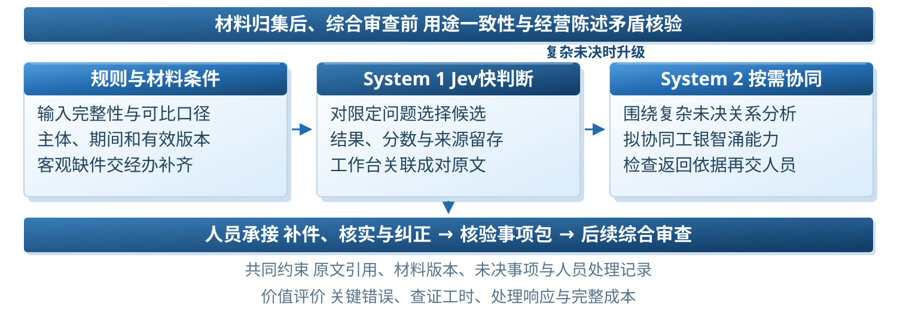

# 工银智涌 e贷

**基于Jev式判断与快慢协同的贷前材料核验引擎**

本项目面向数字金融赛道，聚焦材料归集后、综合审查前的资金用途一致性与经营陈述矛盾核验。通过规则检查、结构化判断、按需复杂分析和人工复核，将核验建议与材料证据、版本和责任记录连续交接。



## 从方法论与产品设计开始

| 文档 | 说明 |
| --- | --- |
| [方法论](docs/METHODOLOGY.md) | 业务任务定义、为什么采用Jev式判断、快慢分工与增量验证 |
| [产品设计](docs/PRODUCT_DESIGN.md) | 使用者、介入位置、补件复核闭环与工小审拟议交接 |
| [最新计划书](docs/plan/) | 用户指定的2026-10-08 Word及阅读用Markdown |
| [蓝色科研图表](docs/FIGURES.md) | 可编辑SVG、300DPI PNG和Word内嵌媒体 |
| [验证记录](docs/VALIDATION.md) | 当前真实结果、负结果与待验证条件 |
| [运行与部署](docs/DEPLOYMENT.md) | 本地流程、官方Jev、社区模型及检查命令 |
| [参考来源](docs/REFERENCES.md) | 官方文档、社区参考及银行公开来源 |

## 核心设计

限定判断任务适配Jev式结构化输出；复杂分析按任务原因升级，并通过证据及人工责任承接。判断服务可以更换，业务任务与材料版本保持。项目不以自由文本生成替代全部核验，也不将核验完成等同于贷款批准。

首期关注三项业务变化：成对原文可回看，补件后按新版本重跑，待处理事项带着证据和人员意见交给后续审查。相对工小审现有能力的新增必要性，需要同任务比较确认。

## 当前验证状态

官方Jev已完成2例协议实测，尚无官方领域批量结果。54份自编开发资料中，社区固定判断与适配头均为40/54；历史28份挑战中快判断17/28、双系统15/28。标签尚未经独立业务复核，当前结果不能证明银行质量、降本或风险收益。

软件流程与模型效果分别记录。完整成本、复核工时与工小审增量的采集模板位于[评审补证材料](docs/evidence-templates/)。

## 本地运行

Python 3.10及以上可运行不依赖模型的流程演示：

```powershell
python -X utf8 demo/app.py --mode simulation --port 8765
```

打开 http://127.0.0.1:8765/ 。官方Jev工作台和社区实验见[运行与部署](docs/DEPLOYMENT.md)。当前服务监听本机，GitHub仓库不承担应用部署。

## 仓库内容

```text
docs/               方法论、产品设计、最新Word、图表与补证材料
demo/               工作台、任务规范、判断后端、证据与留痕
评审整改/           保留原路径的领域实验、官方协议与白名单记录
scripts/            跨机器启动和发布包完整性检查
release-manifest.json 文件清单、来源hash与实验状态
```

模型权重、运行数据库、凭据和历史聊天记忆不进入仓库。实验原始输入、参考标签及冻结代码按原路径保留，避免改变协议中的来源hash。第三方代码许可见[技术来源与许可](THIRD_PARTY_NOTICES.md)。

这是独立竞赛研究原型，工行生态关系为拟议适配，不代表工商银行官方系统或生产接入。
