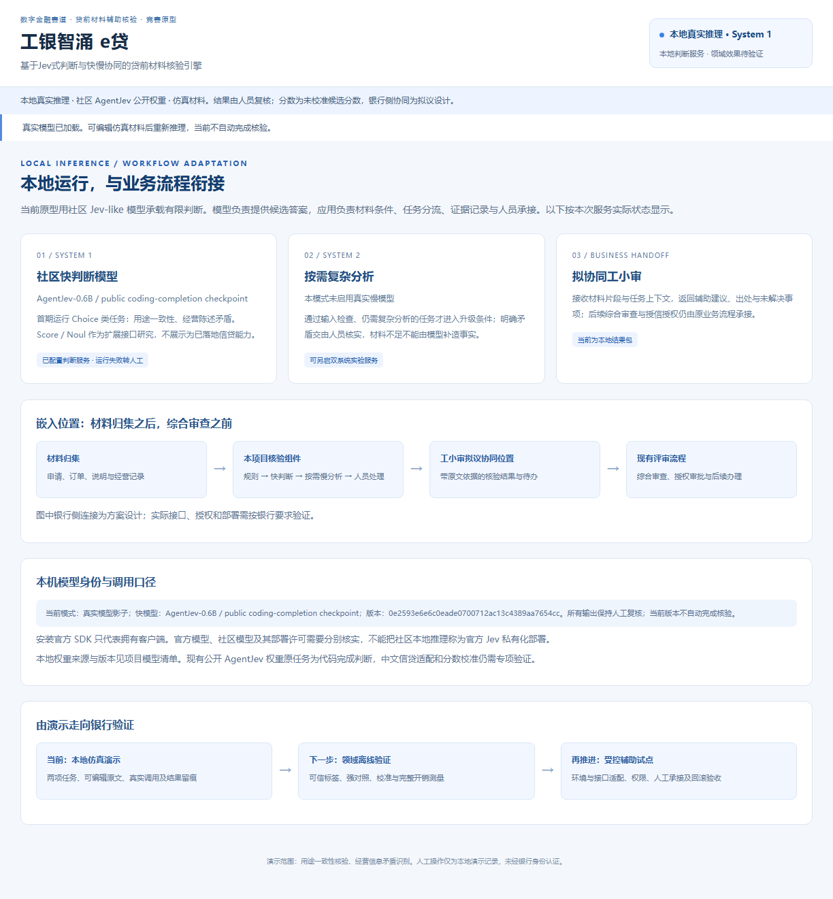
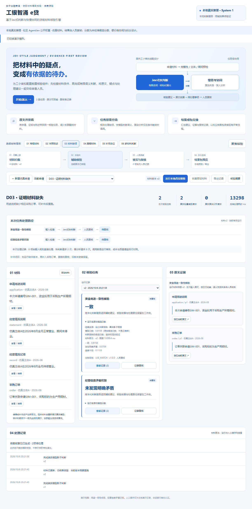
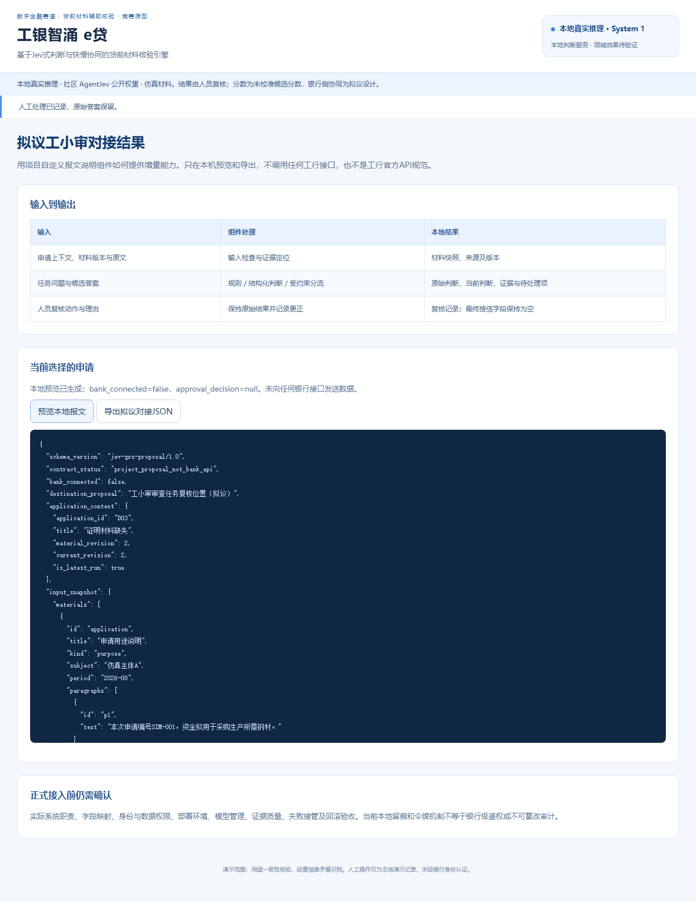
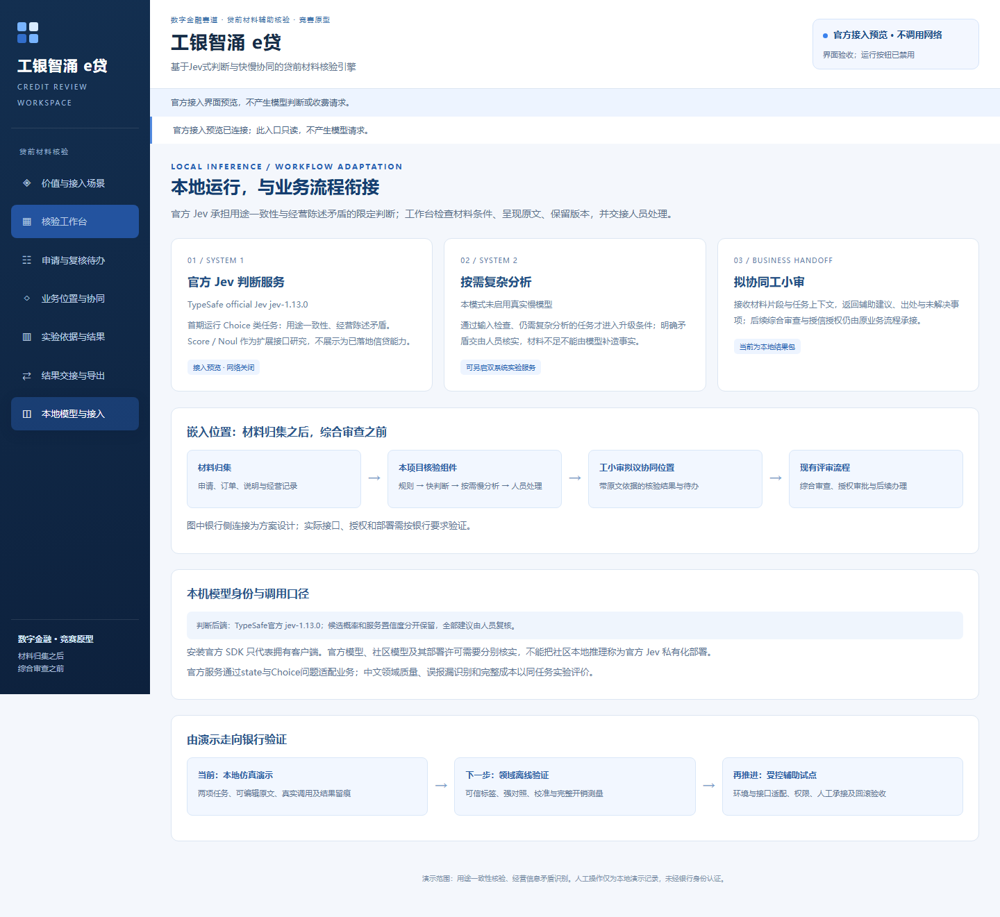
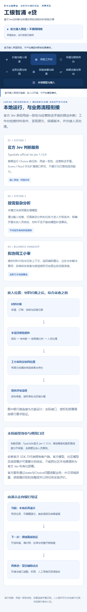
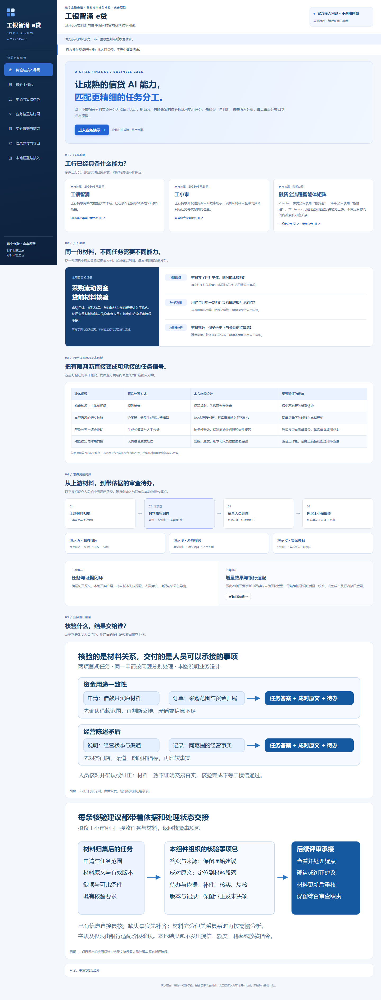
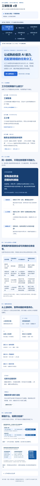
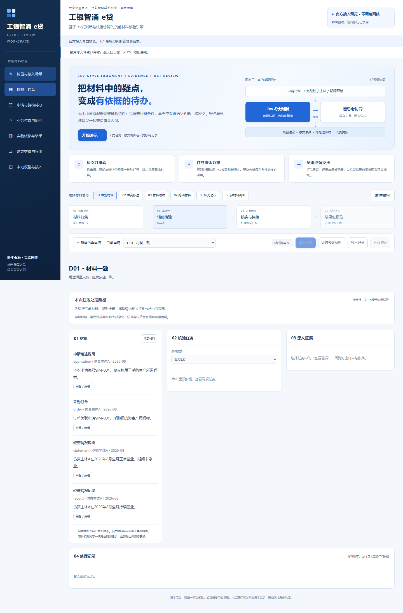
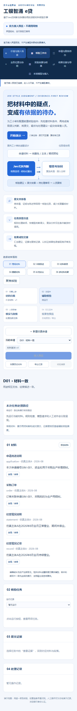

# 蓝色科研图表

在仓库根目录执行`python tools/generate_figures.py`可重新生成SVG，生成文件与已发布原图另行比较，不改变计划书Word。PNG为现有导出资产，不由此脚本重新渲染。

20套项目设计图包含可编辑SVG和PNG；计划书的全部内嵌媒体另存于`assets/word-media/`。

| 图表 | SVG | PNG |
| --- | --- | --- |
| 项目全局总览与前置核验位置 | [矢量图](assets/blue/overview.svg) | [PNG](assets/blue/overview.png) |
| 政策脉络与贷前核验设计响应 | [矢量图](assets/blue/policy.svg) | [PNG](assets/blue/policy.png) |
| 工行信贷生态与前置核验协同 | [矢量图](assets/blue/ecology.svg) | [PNG](assets/blue/ecology.png) |
| 历史双系统升级任务的配对结果 | [矢量图](assets/blue/paired.svg) | [PNG](assets/blue/paired.png) |
| 行业要求向材料核验痛点的转化 | [矢量图](assets/blue/pain.svg) | [PNG](assets/blue/pain.png) |
| 首期切入与价值验证链条 | [矢量图](assets/blue/value.svg) | [PNG](assets/blue/value.png) |
| 目标业务与首期服务范围 | [矢量图](assets/blue/scope.svg) | [PNG](assets/blue/scope.png) |
| 人员操作与价值观察点 | [矢量图](assets/blue/use.svg) | [PNG](assets/blue/use.png) |
| 原型运行模式与共同业务闭环 | [矢量图](assets/blue/runtime.svg) | [PNG](assets/blue/runtime.png) |
| 不确定事项的原因与承接方式 | [矢量图](assets/blue/route.svg) | [PNG](assets/blue/route.png) |
| 领域迭代与版本验证闭环 | [矢量图](assets/blue/version.svg) | [PNG](assets/blue/version.png) |
| 模型采用的分层判断依据 | [矢量图](assets/blue/adoption.svg) | [PNG](assets/blue/adoption.png) |
| 完整核验路径的工时与时延测量 | [矢量图](assets/blue/time.svg) | [PNG](assets/blue/time.png) |
| 分层处理的完整成本构成 | [矢量图](assets/blue/cost.svg) | [PNG](assets/blue/cost.png) |
| 银行适配交付内容与承接关系 | [矢量图](assets/blue/deliver.svg) | [PNG](assets/blue/deliver.png) |
| 数据处理授权与责任边界 | [矢量图](assets/blue/access.svg) | [PNG](assets/blue/access.png) |
| 异常停止与业务恢复闭环 | [矢量图](assets/blue/recovery.svg) | [PNG](assets/blue/recovery.png) |
| 分阶段实施标准甘特图 | [矢量图](assets/blue/gantt.svg) | [PNG](assets/blue/gantt.png) |
| 工小审任务与核验事项包适配 | [矢量图](assets/blue/mapping.svg) | [PNG](assets/blue/mapping.png) |
| 同类任务扩展与交付验收 | [矢量图](assets/blue/expansion.svg) | [PNG](assets/blue/expansion.png) |

## 工作台原型

以下截图来自本地原型及只读界面检查，不作为银行接入或官方领域效果证据。

