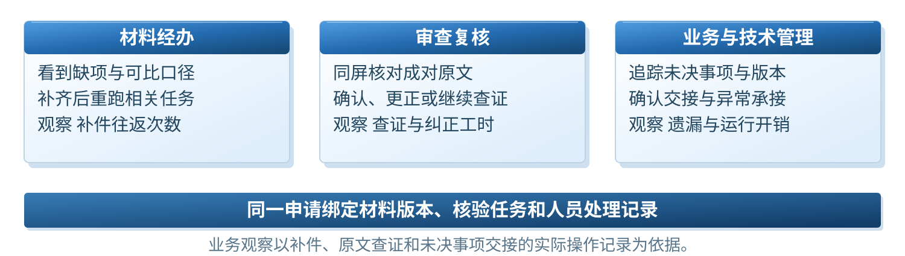
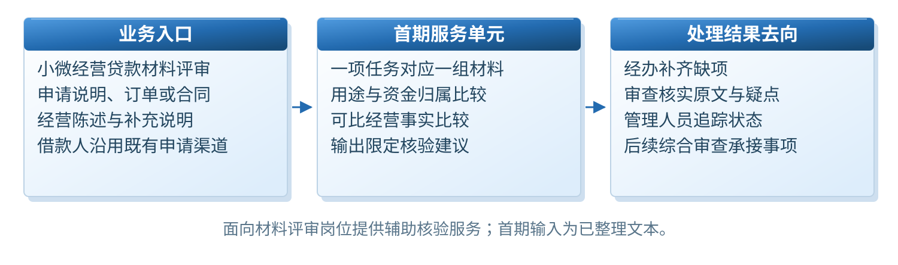
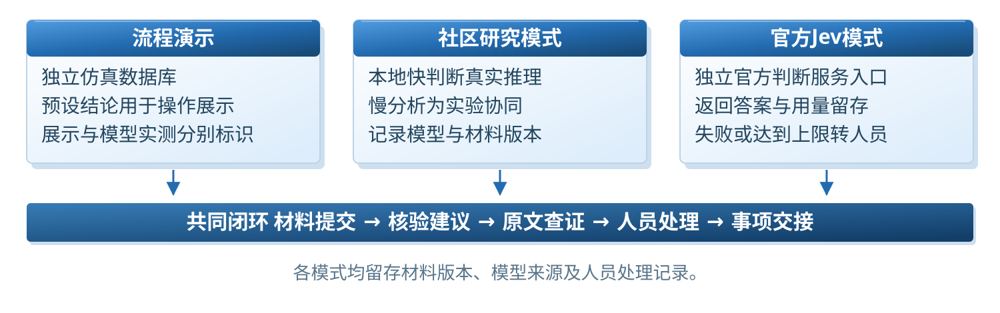
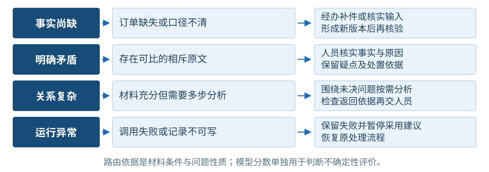
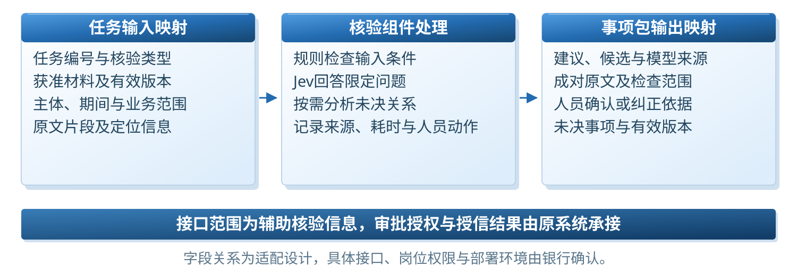
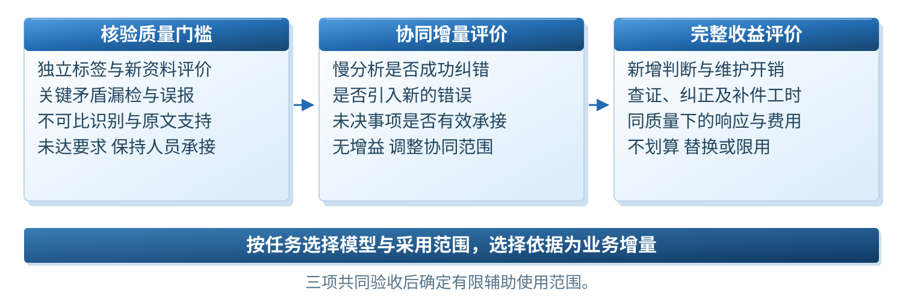

# 产品设计

## 产品位置

工银智涌 e贷定位为贷前材料核验引擎。拟议介入点位于材料归集之后、综合审查之前，向工小审等后续审查流程交付版本化核验事项包。工作台与后端能力可以分别演进，接入模型不改变最终授信责任。

## 使用者与承接关系

| 使用角色 | 主要操作 | 交付内容 |
| --- | --- | --- |
| 客户经理或材料经办人员 | 归集材料、核对缺项、补件重跑 | 当前版本材料与待核验任务 |
| 审查及复核人员 | 回看成对原文、确认或纠正建议、记录依据 | 核实意见与待处理事项 |
| 模型和平台管理人员 | 管理任务规范、模型版本、失败与回退 | 可观测的服务与审计记录 |
| 后续信贷审查系统 | 承接事项包并继续原流程 | 证据、结论、版本与人员责任 |

## 首期业务任务

用途一致性任务比较申请用途说明与对应经营或交易材料，关注主体、用途范围及有效材料。经营矛盾任务比较同主体、可比期间与范围内的经营陈述。缺件、期间不同、语义不足和明确矛盾分别处理，避免把不能比较的材料误报为风险。

## 一条连续的业务闭环

材料入库并建立版本后，先进行完整性与口径检查；符合判断条件的任务进入快判断。结果关联原文位置，并按原因进入复核、补件或复杂分析。人员操作留下处理依据，最后形成事项包交给后续审查。

补件不会覆盖旧材料或旧结果，而是创建新版本并重跑。历史建议保留但不能直接作为新版本的复核结论。人员纠正也不篡改模型原始输出，模型建议与人工意见分别留存。

## 可替换的判断后端

业务任务、判断服务、路由策略与审计台账分离。当前有流程演示、社区判断模型、官方Jev工作台和本地双系统实验入口。官方Jev使用TypeSafe服务，社区实验使用本地公开权重；慢分析实验使用本地Qwen，工银智涌是后续协同适配目标。

mu的参考价值在于任务契约、判断服务、策略和台账的组织方式。本项目采用独立Python实现，围绕贷前材料、证据、版本和人工责任展开，不宣称整套mu已移植。

## 面向工小审的交付

核验事项包包括材料版本、任务版本、模型身份、原始建议、证据索引、未解决事项和人员记录。当前原型可导出相应业务结果，银行真实字段、权限和接口映射需与受控环境确认。

## 优势如何成立

产品优势应体现为可核对的工作变化：定位原文更方便、补件后的结果更明确、疑点不会丢失、复杂分析只在适合的任务上使用、交接责任清晰。前述能力已由原型承接；工时、成本和风险收益仍需与工小审既有能力比较。

## 部署结构

目前工作台与SQLite存储位于个人电脑的本地演示环境，默认仅监听127.0.0.1。官方Jev判断由TypeSafe云端API完成；社区模型和复杂分析实验可在本机运行。GitHub用于保存设计、代码及证据，不承担当前应用服务，也不意味着已经接入工行系统。

拟议银行部署由行内业务入口、任务适配服务、获准判断能力、工银智涌协同服务及行内留痕机制构成。具体部署位置、数据出域条件和权限规则以银行环境审批为准。
