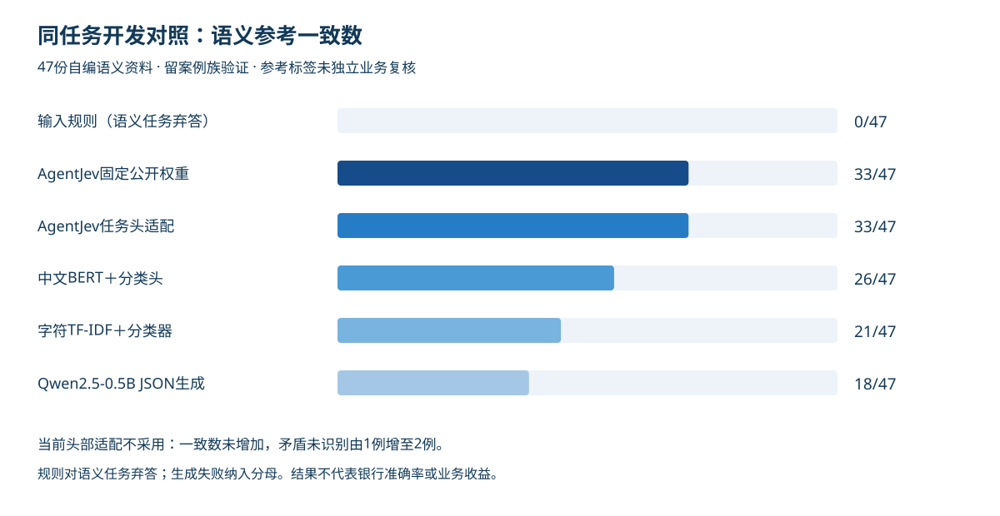
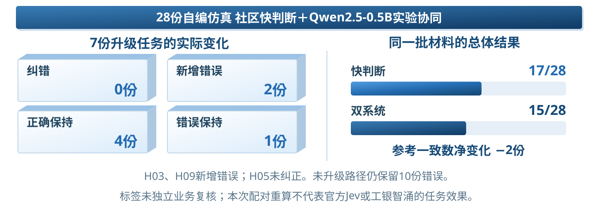
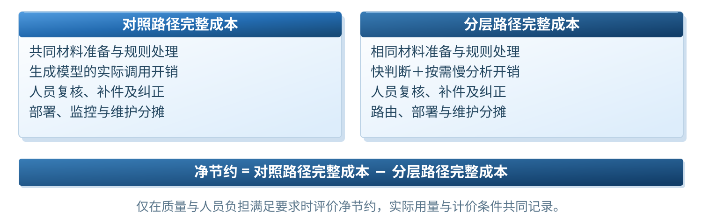

# 验证记录

本页区分实现、软件检查、模型实验与银行收益。数据截至2026-10-08，不新增官方模型调用。

## 已有证据

| 验证范围 | 当前结果 | 可支持的判断 |
| --- | --- | --- |
| 工作台与流程 | 材料版本、规则检查、证据回看、人员复核与导出已实现 | 可以演示业务操作闭环 |
| 软件回归 | PM21原有记录为85项，仓库迁移复核另存报告 | 接口及业务契约按测试范围工作 |
| 官方Jev协议 | jev-1.13.0真实返回2例，均与项目参考一致 | 官方判断协议可运行 |
| 官方领域批次 | 已冻结54份材料，其中47份语义任务、7份规则任务；暂无批次结果 | 已准备同任务实验，尚无官方领域成绩 |
| 54份开发对照 | 社区固定判断40/54、候选头适配40/54、BERT33/54、TF-IDF28/54、Qwen25/54 | 当前仿真开发任务中的实现比较 |
| 历史28份挑战 | 快判断17/28、实验双系统15/28 | 当前双系统尚未证明质量增量 |
| 工小审比较与收益 | 未取得既有任务表现、独立业务标签、完整工时费用 | 尚不能确认具体能力缺口及银行收益 |

54份资料为自编仿真材料，案例族隔离并不等于独立业务标签。不同模型的预训练、规模和适配资源不同，成绩不能解释为Jev范式相对Transformer结构的因果优势。

## 官方服务记录

两次官方请求输入合计1158Token，输出合计112Token，端到端耗时分别1223.1ms和1091.32ms，包含外部网络影响。原始白名单响应与验收简报位于`评审整改/PM20_官方Jev判断头最小验证/run_20261007T060327173836Z/`。两例不用于估计银行准确率、校准效果或成本收益。

## 快慢协同的配对结果

历史7次升级中纠错0例、新增错误2例、正确保持4例、错误保持1例。还需要检查快路径未升级的错误。质量提升不能仅由“触发了慢思考”推断，采用范围应依据任务级配对结果决定。

## 需要补齐的三项证据

1. 与工小审使用相同材料和任务，确认既有覆盖与新增必要性。
2. 取得独立业务参考标签，在新资料上验证任务质量、升级条件和协同效果。
3. 在质量要求一致时测量完整处理成本、复核工时、时延和关键错误。

采集模板位于[评审补证材料](evidence-templates/)。空白字段代表尚未测量，不是零费用或零错误。

## 文档版本与验收范围

`docs/plan/`保存用户2026-10-08指定的最新Word原样副本及阅读用Markdown。上传前核对源文件和副本的SHA256，源Word不改动。

这份Word与前一轮验收哈希不同。`docs/qa/previous-render/`保留的54页、43图、16表记录只适用于其登记的旧哈希；不自动作为最新稿验收。阅读用Markdown是便于检索的提取稿，不替代Word版式。新GitHub整理与迁移检查见`docs/qa/repository-checks.json`。
