# 工银智涌 e贷

## 基于Jev式判断与快慢协同的贷前材料核验引擎

> 从用户2026-10-08指定Word原样提取的阅读副本。Word是正式版式文件；本页保留正文、表格、内嵌图片与脚注文本，不替代版式验收。

[下载正式Word](./%E5%B7%A5%E9%93%B6%E6%99%BA%E6%B6%8C%20e%E8%B4%B7%E2%80%94%E2%80%94%E5%9F%BA%E4%BA%8EJev%E5%BC%8F%E5%88%A4%E6%96%AD%E4%B8%8E%E5%BF%AB%E6%85%A2%E5%8D%8F%E5%90%8C%E7%9A%84%E8%B4%B7%E5%89%8D%E6%9D%90%E6%96%99%E6%A0%B8%E9%AA%8C%E5%BC%95%E6%93%8E.docx)

## 团队介绍

刘坤，团队队长，湖南财政经济学院2024级金融科技专业本科生，英语六级。PandaAI EVO官方产品内测员，SAIFSA上海交大高金量化投资俱乐部会员，中国技术经济学会及金融科技委员会学生会员。负责业务方案与产品架构、原型开发与Jev服务集成、计划书统筹。

李超，团队成员，湖南财政经济学院2024级经济统计学专业本科生，英语六级。负责仿真材料与参考标签整理、对照实验设计、统计分析与图表制作，协同开展结果核查与报告编写。

两人共同开展核验口径讨论、案例检查与成果审阅。

成员经历与竞赛基础：成员过往竞赛经历涉及信息检索、数学建模、银行运营与市场分析，为本项目的资料研究、业务设计和实验评价提供基础。

1.“搜知杯”全国财经高校信息素养大赛全国一等奖

2.“华数杯”全国大学生数学建模竞赛全国一等奖

3.高校经济决策虚仿实验大赛智慧银行数字化运营全国二等奖

4.“iCAN杯”大学生创新创业大赛全国三等奖

5.“高教社杯”全国大学生数学建模竞赛湖南省一等奖

6.“正大杯”市场调查与分析湖南省一等奖

7.“工行杯”全国大学生金融科技创新大赛湖南省一等奖

8.全国大学生统计建模大赛湖南省二等奖

## 前言

工银智涌 e贷——基于Jev式判断与快慢协同的贷前材料核验引擎，立足数字金融赛道，聚焦小微经营贷款用途一致性与经营陈述矛盾，为工小审相关任务设计前置组件。

组件位于材料归集后、综合审查前。规则检查材料条件，快判断回答限定问题，复杂关系按需协同工银智涌；建议、成对原文与未决事项交由人员补件、核实和交接。

项目已完成本地原型、可替换判断服务和六方案开发对照，并以官方Jev完成两项仿真任务的结构化协议验证。方案围绕证据与人员责任组织快慢协同，探索减少重复判读和无效分析；采用范围由领域评价与受控业务测量确定。整体架构如图0-1所示。

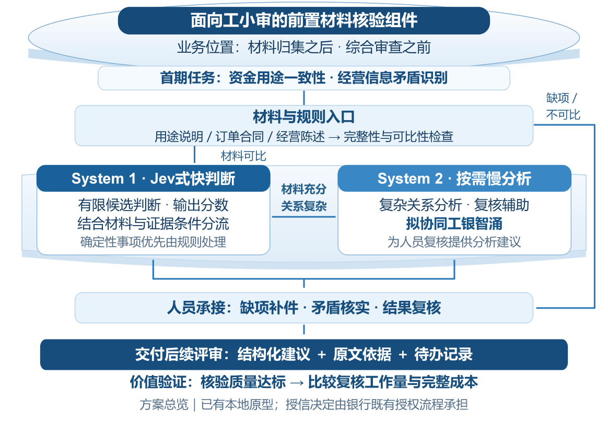

图0-1 项目全局总览与前置核验位置

## 目录

前言3

## 一、项目背景1

### （一）数字金融政策背景1

### （二）工行智能信贷基础2

### （三）贷前材料核验痛点3

### （四）项目切入与价值方向5

## 二、业务场景与产品定位6

### （一）目标业务与服务对象6

### （二）使用人员与职责分工7

### （三）首期任务与材料范围7

### （四）业务位置与协同关系8

### （五）使用价值与适用范围9

## 三、产品方案与业务流程10

### （一）产品能力与处理边界10

### （二）核验任务与判断方式11

### （三）任务分流与快慢协同13

### （四）工作台与原文核对15

### （五）补件处理与版本管理17

### （六）核验摘要与结果交接18

### （七）运行模式与功能验证20

## 四、技术架构与方案创新21

### （一）分层架构与能力分工21

### （二）材料组织与判断依据23

### （三）模型适配与选型原则24

### （四）金融场景适配创新26

### （五）领域数据与验证设计26

### （六）任务路由与异常接管28

### （七）系统接口与业务适配29

## 五、实验验证与结果分析30

### （一）验证范围与评价口径30

### （二）领域对照与结果分析32

### （三）模型质量与业务效果35

### （四）数据管理与版本验证36

### （五）模型采用与验证安排37

## 六、业务价值与成本分析38

### （一）业务价值与评价范围38

### （二）核验质量与工作效率39

### （三）服务计费与完整成本40

### （四）收益测量与采用条件41

### （五）交付内容与服务方式42

## 七、风险管理与数据治理43

### （一）数据使用与责任分工43

### （二）证据管理与版本留存44

### （三）风险识别与处置机制45

### （四）停止使用与恢复条件46

## 八、实施路径与推广规划46

### （一）实施阶段与验收条件46

### （二）工小审任务适配48

### （三）银行离线评估与受控使用48

### （四）阶段交付与任务扩展49

## 一、项目背景

### （一）数字金融政策背景

本项目立足数字金融赛道，以普惠信贷材料评审为应用场景，研究数字技术如何改善信息处理、任务配置与人机协同。《国务院关于推进普惠金融高质量发展的实施意见》提出推进数字普惠金融发展，为运用数字技术改善小微金融服务提供政策依据。[]

效率提升需要与数据治理相衔接。《银行保险机构数据安全管理办法》规定了数据全生命周期安全管理要求。[]本项目据此将材料权限、原文留存、处理记录与人员复核纳入设计。如图1-1所示，政策要求转化为效率、证据和治理三方面的产品响应。

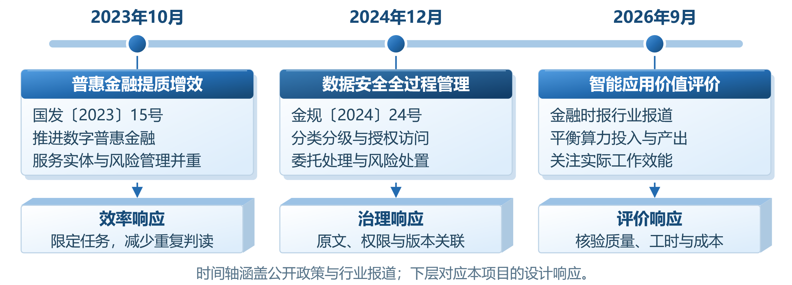

图1-1 政策脉络与贷前核验设计响应

### （二）工行智能信贷基础

工行2025年度报告披露，智贷通是面向融资全流程的智能体矩阵，工小审是信贷评审AI数字助手。[]本项目以工小审材料评审任务为切入点，设计与工银智涌协同的前置组件。

经营快贷官方说明体现了数据分析与经营情况核实相衔接的业务特点。本项目以既有评审能力为基础，研究限定核验、原文组织和版本交接的增量价值：围绕同一材料、同一任务及相同复核要求，比较既有处理方式与增加本组件后的表现。是否采用组件，由关键错误、查证工时和完整资源成本的改善共同决定；能力重叠且无增量收益时，直接复用既有能力。[]

如图1-2所示，组件围绕现有材料归集与评审分工组织任务，向工小审相关工作交付可核对的建议和待处理事项。

图1-2 工行信贷生态与前置核验协同

### （三）贷前材料核验痛点

公开政策要求提升普惠金融数字化服务能力，行业报道同时指出信息获取难、服务成本高和规模不经济等问题。落实到贷前材料评审，关键在于能否把分散陈述转换为可比较的事实，把核验疑点交给合适的处理环节。本项目据此归纳材料条件、语义判断、责任承接和资源配置四类难点。[]

材料条件首先影响核验能否开展。申请说明、订单和经营陈述可能来自不同时间、主体或业务范围；相同指标也可能采用不同统计口径。审查需要先确认材料齐全及比较条件，才能判断差异是否属于矛盾。将材料缺失直接解释为风险，或将不可比陈述直接判为冲突，都可能增加无效补件和核实。

语义判断的难点在于表述与事实并非一一对应。借款用途与订单品类不同，可能是订单中部分支出由自有资金承担；经营状态不同，也可能对应不同门店、渠道或子期间。核验应聚焦具体资金和可比经营事实，保留支持或相斥的原文，使复核人员能够检查判断依据。

责任承接要求与材料判断同步设计。材料更新后，原结论可能不再适用；同一申请中，已完成任务与待核实疑点也需要分开管理。数据安全要求进一步约束材料权限、处理记录和留存。本项目将任务、原文、版本及人员动作共同组织为事项包，便于后续评审承接。

资源配置是银行智能化应用的另一项评价重点。金融时报提出，银行需平衡算力投入与价值产出。贷前核验中的缺项检查、限定语义判断与复杂关系分析需要不同处理能力；组件的必要性应由同任务质量、人员工作量和完整成本共同检验，而不能仅以模型调用减少作为降本结论。[]

表1-1 材料核验问题与产品响应

| 核验问题 | 对审查工作的影响 | 本项目的处理方式 |
| --- | --- | --- |
| 材料与口径 | 主体、期间或范围不同，差异可能被误判为矛盾。 | 检查可比条件，列明缺项及原因。 |
| 语义与事实 | 同义改写、资金归属与局部事实差异增加判读难度。 | 围绕限定问题判断，关联成对原文。 |
| 疑点分流 | 缺件、明确矛盾与复杂关系需要不同承接。 | 分别进入补件、核实与按需分析。 |
| 版本与交接 | 补件后旧结论可能失效，未决事项容易遗漏。 | 绑定有效版本，保留纠正与待办。 |
| 资源与效能 | 调用开销与人员复核共同影响实际收益。 | 按任务配置能力，同质量评价完整成本。 |

表1-1将上述难点对应到人员工作的影响与首期处理方式。产品聚焦用途一致性和经营陈述矛盾，先确认比较条件，再形成限定核验建议及原文依据；客观缺件由经办补齐，明确矛盾由人员核实，材料充分但关系复杂时按需分析。核验结果随有效材料版本交接，帮助评审区分已处理与未解决事项。

如图1-3所示，公开政策与行业要求分别对应材料比较、责任承接和能力配置，形成首期产品的设计依据。

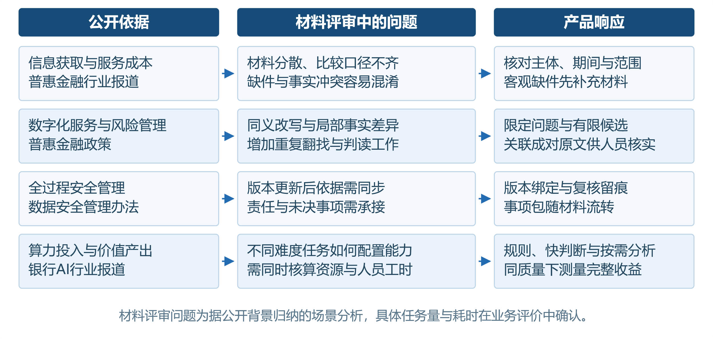

图1-3 行业要求向材料核验痛点的转化

### （四）项目切入与价值方向

Jev以选择、评分和概率估计等原语组织结构化判断。本项目首期采用有限候选判断，构成快思考层（System 1）；慢思考层（System 2）按需处理复杂关系。将两者与规则、证据检查及人员复核衔接，是本项目的场景设计重点。[]

首期介入点为材料归集后的辅助核验。组件将客观缺件、明确矛盾和复杂关系分别整理为补件、核实和分析事项，处理记录随材料流转，授信决定沿用银行既有授权流程。

方案的业务价值主要体现在关键矛盾识别、材料查证、复核工作组织和计算资源配置。核验质量、人员工作量与完整处理成本构成后续效果评价的共同指标。

如图1-4所示，首期价值沿材料关系判断、证据组织、人员处理和业务评价逐步验证，核验质量与完整成本共同决定采用范围。

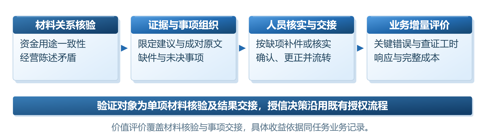

图1-4 首期切入与价值验证链条

## 二、业务场景与产品定位

### （一）目标业务与服务对象

项目立足数字金融赛道，面向工行普惠信贷材料评审，拟与工小审相关任务协同。借款人沿用银行既有渠道提交材料，经办、审查复核及模型管理人员围绕同一核验任务协作，结果回传既有评审流程。

工行公开披露的普惠业务规模与智能信贷建设，为开展材料核验研究提供了业务基础。[]本项目以单项核验为服务单位，围绕具体材料关系确定处理范围。

如图2-1所示，产品以单项材料核验为服务单元，围绕已归集材料组织问题与处理结果，面向经办、复核和管理岗位服务。

图2-1 目标业务与首期服务范围

### （二）使用人员与职责分工

如表2-1所示，组件为经办人员提供缺项清单，为复核人员提供成对原文与疑点依据，为管理人员提供任务状态和处理记录。结果以任务为单位交接，便于嵌入现有评审工作。

表2-1 使用者需求与产品响应

| 使用者 | 原有工作中的关注点 | 本组件提供的处理信息 | 拟验证的业务收益 |
| --- | --- | --- | --- |
| 材料经办 | 缺什么材料、怎样补齐 | 缺项与口径事项，补件后重跑 | 补件说明更明确，往返次数减少 |
| 审查复核 | 差异是否矛盾、依据在哪里 | 任务建议、成对原文、纠正入口 | 减少翻找与重复判读 |
| 业务与技术管理 | 还有哪些疑点、版本是否有效 | 未决事项、处理依据与运行记录 | 交接遗漏与旧结论复用可检查 |

后续业务系统是结果承接方，接收核验建议、证据引用和未解决事项。人员按银行既有权限确认与处置，任务处理记录随材料流转。

### （三）首期任务与材料范围

首期面向小微经营贷款采购资金申请。用途任务比较申请说明与订单、合同中的资金归属和用途范围；经营任务比较同一主体、可比期间及业务范围内的陈述。两项任务均输出限定答案，并保留信息不足或无法比较。

两项任务共用材料比较、证据引用和版本记录机制。首期输入采用已整理文本，分别记录“信息不足”“无法比较”等判断结果及各项疑点；单项核验结果交由综合审查承接。

### （四）业务位置与协同关系

经办人员选择任务并提交相关材料；系统先检查缺项和可比条件，再开展限定范围的语义判断，展示建议与原文。人员据此确认、纠正或发起核实；材料不足时补件，材料充分但需要深入分析时按需协同慢思考。

如图2-2所示，三类人员与后续业务系统共同承接材料、依据和处理记录。

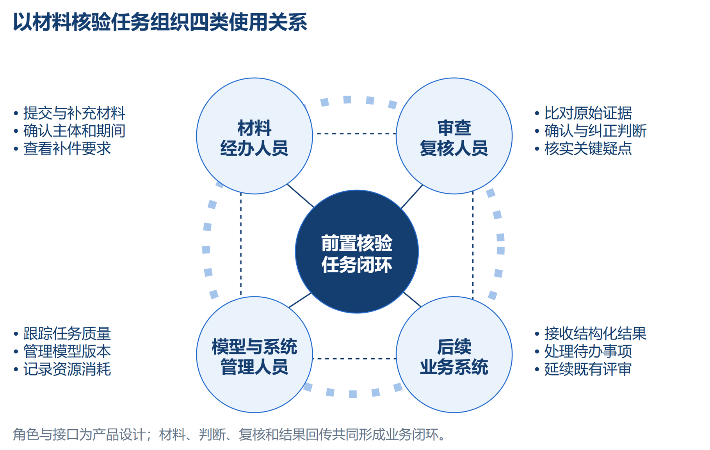

图2-2 四类使用关系与核验闭环

补件或纠正后生成新版本，相关任务重新核验，历史结果与处理记录保留。本地原型以仿真材料展示该业务闭环。

如图2-3所示，组件位于材料归集之后、综合审查之前。核验建议与待处理事项交由后续评审承接，授信决定仍由银行既有授权流程承担。

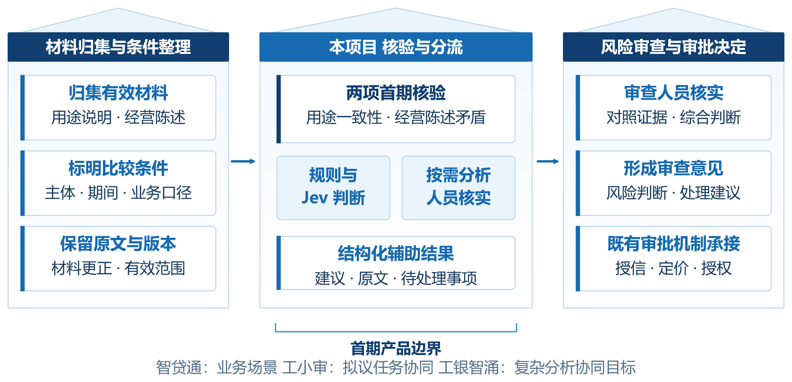

图2-3 审批相关工作的分层与首期介入位置

### （五）使用价值与适用范围

产品围绕现有人员分工组织核验工作：经办按缺项补齐材料，复核人员沿疑点查看原文，管理人员追踪更正与未决事项。预期减少材料翻找、补件往返和重复判读，具体收益通过业务工时验证评价。

业务效果按实际操作计量，分别记录补件往返次数、查证与处理工时、交接遗漏及版本问题，并结合模型资源消耗核算完整成本。现有原型已具备上述信息的组织与交接能力。

如图2-4所示，经办、复核及管理人员的操作分别对应补件、查证和交接观察点，业务收益按实际工作记录评价。

图2-4 人员操作与价值观察点

首期围绕两项核验任务确定使用范围，统一任务规范、结果承接方式与运行要求。以下产品方案展示材料如何进入工作台、疑点如何处理及结果如何交接，实施安排见第八章。

## 三、产品方案与业务流程

### （一）产品能力与处理边界

本产品面向信贷审批流程中的材料评审层，拟以工小审相关任务为协同入口。组件接收任务及已归集材料，整理核验建议、成对原文和待办，供评审人员核对与处置；授信、额度、定价和放款由银行既有授权流程承担。

用途关系与经营矛盾需要语义理解，结论范围可以预先约定。产品将可比材料交由快层形成有限候选建议，围绕未决关系按需开展复杂分析，采用依据与模型选择见第四章。

如图3-1所示，System 1处理答案范围明确的局部判断，System 2按需分析复杂关系。规则校验、材料索引与人员复核共同形成处理约束。团队重点设计金融任务与快慢协同流程，基础模型能力来自所选模型。

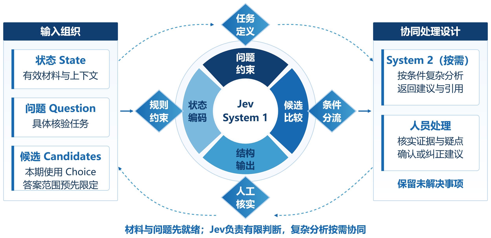

图3-1 快慢双系统材料核验引擎整体架构

### （二）核验任务与判断方式

表3-1明确两项任务的输入关系和答案含义。系统先确认主体、期间、用途范围及有效版本，再比较原文；“材料不足”和“明确矛盾”采用不同结果与处理路径。

表3-1 首期核验任务与结果边界

| 任务 | 比较范围 | 候选答案 | 依据与结果边界 |
| --- | --- | --- | --- |
| 用途一致性 | 同一申请用途说明与相关合同、订单或补充说明 | 一致／存在明确矛盾／信息不足 | 定位用途支持或矛盾的可比原文；核验范围为材料陈述关系 |
| 经营陈述矛盾 | 同一主体、可比期间和同一指标口径的经营文本 | 发现明确矛盾／未发现明确矛盾／无法比较 | 指出相斥陈述或不可比原因；未发现矛盾仅限本次检查范围 |

例如，申请说明借款仅用于采购木板，而订单同时包含木板与设备时，核验先识别资金归属。设备由自有资金支付，属于不同资金范围；材料明确借款全部用于设备，则与申请用途冲突。系统据材料关系形成建议，并关联支持结论的原文。

如图3-2所示，Choice用于从候选答案中选择，Score用于按量表评分，Noul用于判断明确命题。首期实现两项Choice任务，Score和Noul纳入后续扩展设计，按任务需求分别验证与采用。

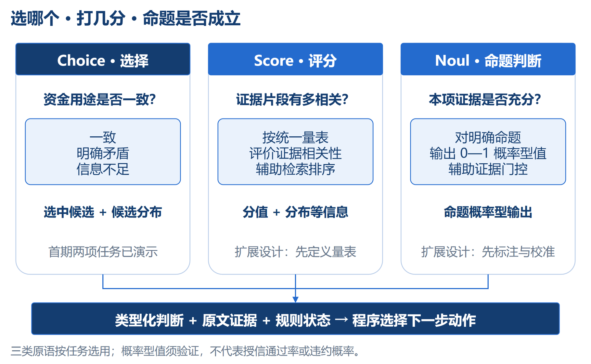

图3-2 Jev三类判断原语与信贷任务映射

首期采用Choice输出候选答案及判断分布，原文索引与人员复核分别保留。候选分数描述模型对当前问题的判断倾向，贷款获批率和违约概率属于独立的业务指标。

如图3-3所示，两项任务都先对齐比较范围，再把结论与原文、待办关联。人员据此核实差异，避免将不同资金、渠道或子期间直接判成冲突。

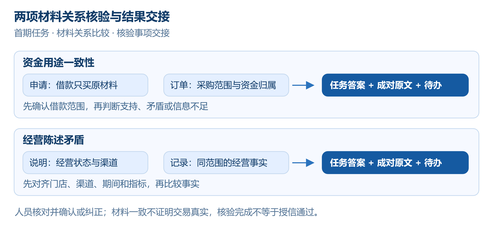

图3-3 两项首期任务的材料比较关系

原型以一笔小微采购资金申请展示两项任务的使用方式，图3-4呈现材料条件检查、用途与经营核验、人员处理之间的分工。

以下界面对应上述核验流程，围绕原文查证、补件重跑、疑点处理和事项交接展开。

图3-4 首期业务场景与任务分工

### （三）任务分流与快慢协同

如图3-5及表3-2所示，任务分流先检查材料与业务条件：客观缺件进入补件流程，明确矛盾交人员核实，材料充分但关系复杂时按需协同慢思考。模型分数用于识别判断不确定性，材料充分性单独检查。

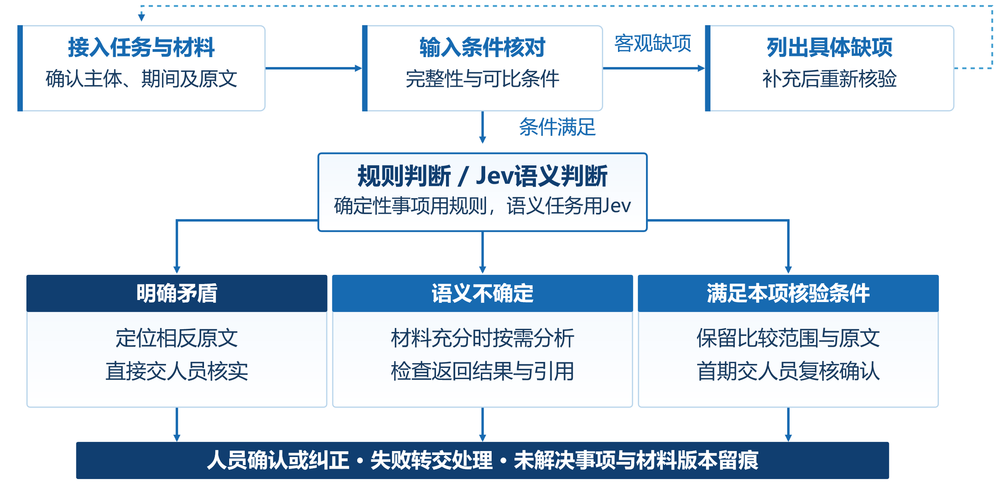

图3-5 材料核验任务分流与异常处理流程

表3-2 任务状态与处理路径

| 任务状态 | 建议路径 | 交付内容 |
| --- | --- | --- |
| 缺件或关键口径不清 | 补件或核实输入 | 缺项、口径问题及重新核验条件 |
| 明确规则能够回答 | 规则处理 | 依据、结果与对应材料 |
| 语义判断满足任务条件 | 形成待复核建议 | 答案、原文与检查范围 |
| 发现明确矛盾 | 人工核实 | 成对原文、疑点与版本 |
| 材料充分但关系复杂 | 按需慢分析 | 待解决问题、相关材料与引用 |
| 调用失败或问题未解决 | 人工接管 | 已有结果、失败原因与未决事项 |

慢思考返回后，系统检查答案、引用及未解决事项。首期每项任务最多请求一次慢分析，失败或仍无法解决时转人工，并保留快判断与实际消耗。明确矛盾持续作为待核实事项管理。

当前模型建议统一经人员复核。单项辅助核验的自动完成作为后续能力，采用前需验证证据条件、接受阈值和接受部分的错误率，并取得相应业务授权。

### （四）工作台与原文核对

工作台围绕材料、核验任务与原文证据组织。人员可在同屏查看被比较的陈述，确认、纠正或继续核实；补件后重跑相关任务。表3-3列出交付信息及用途，使结果能够被后续评审承接。

表3-3 任务结果与业务用途

| 返回内容 | 业务用途 |
| --- | --- |
| 任务、材料及版本 | 明确核验对象，补件后生成新记录 |
| 候选答案、分数及来源 | 展示核验建议、模型来源与候选判断分布 |
| 原文引用、缺项与可比性 | 供人员核对依据，识别尚缺的事实 |
| 路由原因与处理记录 | 说明后续动作，保留确认、纠正与未决事项 |
| 调用、失败与耗时 | 核对完整处理开销，支持版本间比较 |

常规核验摘要由任务答案、原文引用与处理记录汇总形成；未解决的疑点单独列示，供复核人员继续核实或发起复杂分析。

图3-6展示2026年10月2日真实快判断记录。工作台将材料、核验建议与成对原文同屏组织，人员可对照原文确认建议、记录纠正或继续核实疑点。

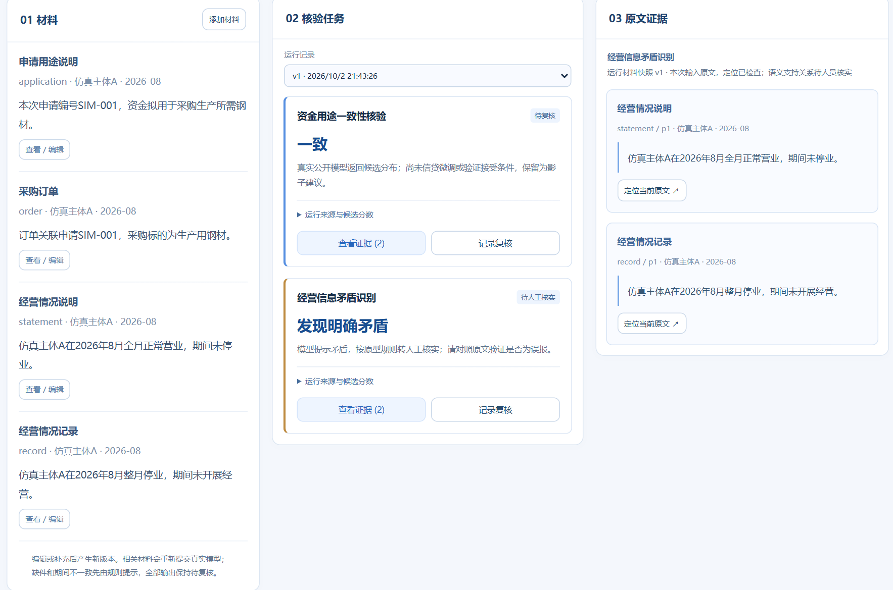

图3-6 真实快判断记录与成对原文

图3-7展示人工复核入口，记录处理动作与原文依据。矛盾持续作为待核实事项管理，人员更正与原始建议分别留存。

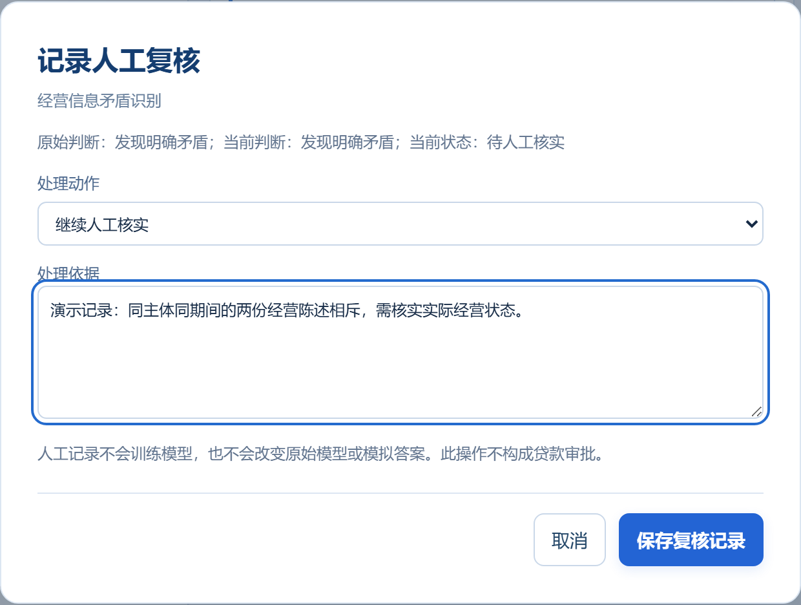

图3-7 疑点核实与处理依据入口

### （五）补件处理与版本管理

如图3-8所示，订单缺失时系统生成补件提示；材料补齐后生成新版本，原结果归入历史记录，相关任务重新核验。

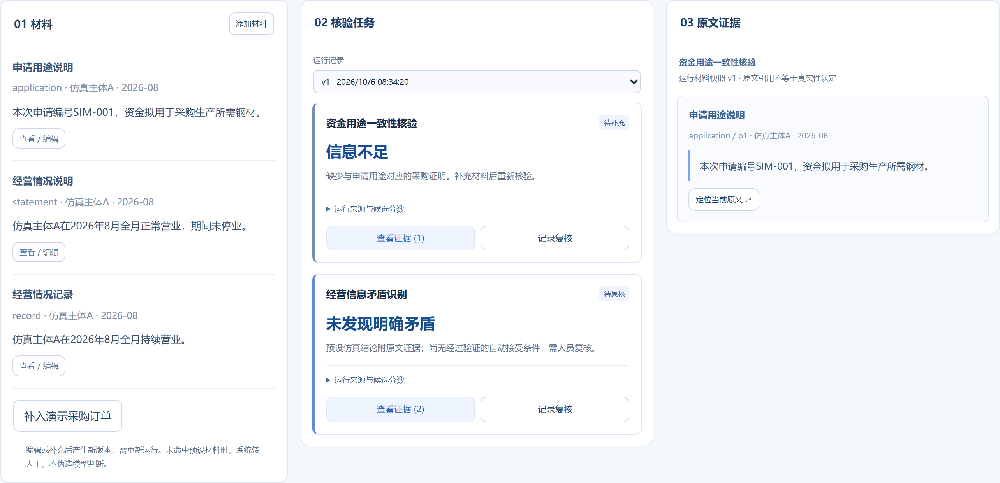

图3-8 缺项提示与补件重跑入口

图3-9展示当前材料版本下的待办与人员处理记录。已处理任务、待核实疑点和未补齐事项分别显示，供后续综合审查承接。

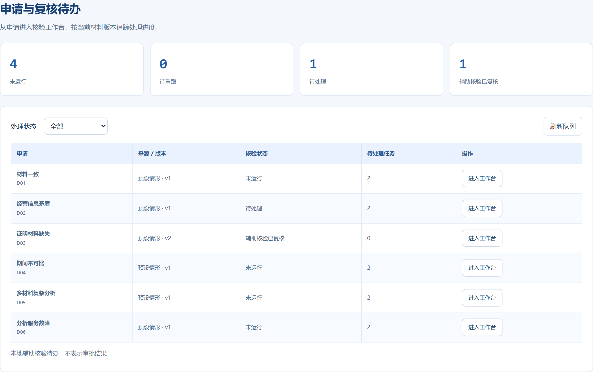

图3-9 申请与复核待办

### （六）核验摘要与结果交接

如图3-10所示，拟向工小审相关任务回传核验事项包，包括答案与来源、成对原文、处理依据、材料版本及未决事项。复杂分析以工银智涌为协同目标，具体接口与权限在银行适配阶段确认。

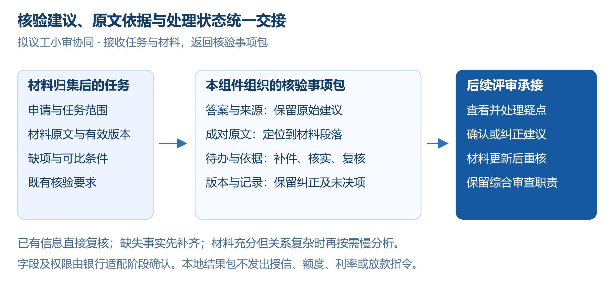

图3-10 面向工小审的核验事项交接设计

核验事项包以单项任务为单位交接，记录缺件处理、矛盾核实、复杂分析和人员处置结果。补件后重新核验相关任务，原始建议与更正依据保留，后续评审可持续追踪未决事项。

如图3-11所示，辅助核验摘要汇总任务答案、成对原文和处理依据，为复核与交接提供一致的信息结构。复杂事项按需进入分析流程。

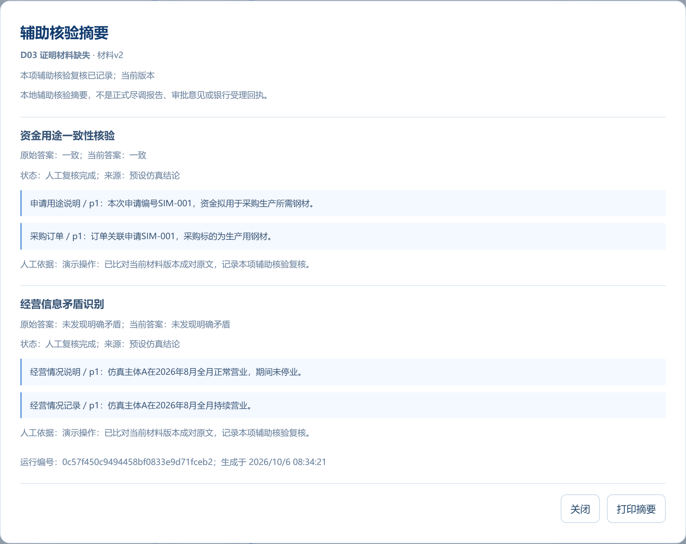

图3-11 辅助核验摘要

图3-12展示拟议结果交接内容，包括任务范围、材料版本、核验建议及来源、处理记录和未决事项。原型支持本地预览与导出，接口范围限定为辅助核验信息。

图3-12 拟议协同输入与输出

图3-6取自历史真实推理记录；图3-4、图3-7、图3-8、图3-9、图3-11和图3-12采用独立仿真数据库与预设结论展示操作流程。

### （七）运行模式与功能验证

原型保留流程演示、社区快判断和本地双系统实验，并增加官方Jev独立入口。官方后端承接同一任务规范，沿用材料版本、原文查证、人员复核及事项交接；请求失败或达到上限时转人员处理，原判断与更正记录分别留存。复杂分析通过独立模式评价。

交互围绕三类实际处理动作组织：缺件后补充材料并重跑相关任务；识别矛盾后定位成对原文并记录核实依据；人员纠正后生成包含原始建议、当前结论及未决事项的交接包。每次处理绑定材料版本，帮助经办与复核人员持续追踪疑点。

原型通过85项软件回归，覆盖材料版本、规则门控、官方判断记录、异常接管和人员交接。官方新增后端的测试检查单项失败不覆盖其他结果、达到请求上限停止调用，以及判断身份和用量随事项包留存。官方两例协议实测按第五章所列配置独立记录。[]如图3-13所示，三种运行模式共用材料版本、复核和交接流程，演示结论、社区推理与官方返回分别标识。

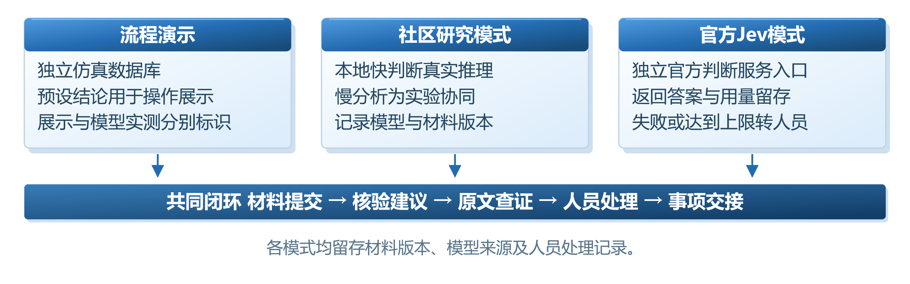

图3-13 原型运行模式与共同业务闭环

本地原型形成材料提交、任务核验、原文查证、人员处理与事项交接的闭环。下一章进一步说明支撑该流程的能力分工、模型选择及金融场景适配设计。

## 四、技术架构与方案创新

### （一）分层架构与能力分工

技术架构将核验任务与模型实现分开管理。每项任务统一问题、材料范围、候选答案和结果去向，便于维护审查口径、追踪处理依据及替换快层模型。如图4-1所示，各层分别承担材料组织、规则校验、判断、路由与复核职责。

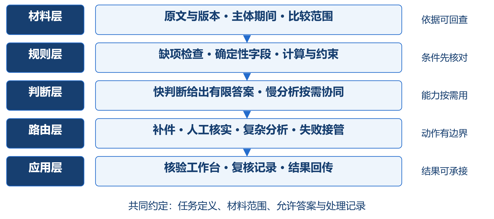

图4-1 材料核验的技术分层与职责

官方Jev作为可选System 1判断后端，接入项目既有任务规范与材料核验流程；社区AgentJev保留为本地研究基线。两者分别记录模型版本、判断和用量，便于比较与替换。业务任务、原文索引、异常承接和复核责任由本项目管理。[]

架构借鉴mu的版本化任务、判断服务、策略编排与运行记录分离方式，复用System One接口约定，将编程任务替换为信贷材料关系核验。模型异常形成真实失败记录并转人工；审计写入失败时暂停采用建议，材料更正触发新版本重跑。规则、判断、复杂分析与人员责任按业务性质分别配置。

用途一致性与经营陈述矛盾需要理解语义，但结论可限定为三类候选。Jev式判断将材料分析收敛为明确的局部问题，使后续流程依据统一答案处理，而无需先从自由文本中解析结论。规则负责条件检查，快层负责可比材料的关系判断，人员与复杂分析能力承接未决事项。

本项目借鉴有限候选判断方式，将其与规则、证据和人员交接结合。已有可比材料由快层核验，缺失事实先补充取证，复杂关系按需分析。团队的创新重点是面向金融任务的协同编排。[7]

预期工程收益来自有限答案输出与按任务调用：减少自由文本解析，使复杂分析围绕具体疑点展开，并统一记录模型消耗和人员处理。普通分类器与短输出生成模型同样纳入对照；是否采用官方Jev，取决于相同任务下的漏识别、误报、证据支持、响应和完整成本。

### （二）材料组织与判断依据

每项输入绑定主体、期间、原文段落和有效版本。首期使用已整理文本；后续材料解析与检索纳入统一的质量和成本评价。材料中的指令性文字按原文处理，核验规则与处理权限由系统配置控制。

如图4-2所示，材料归集后先检查完整性与比较口径，符合条件的用途一致性、经营陈述矛盾任务交由官方Jev判断。限定答案与候选分布、服务置信度分别留存，工作台从材料索引组织原文依据，形成可由人员承接的核验事项包。复杂未决关系按需协同工银智涌的适配路径另行验证。

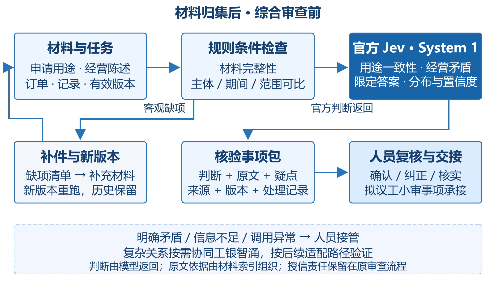

图4-2 官方Jev判断与贷前核验业务承接

长材料处理按完整检查范围选取相关片段，并记录选取依据；关键上下文缺失时进入补充或核实流程。核验结论的适用范围随已检查内容一并输出。

### （三）模型适配与选型原则

模型适配采用两条独立路线：官方Jev通过业务状态、任务说明和候选判定标准适配场景；社区模型可在授权与许可范围内训练任务头或微调底座。官方文档明确，其服务不以客户资料进行账户级微调，中文任务应单独验证。[]

本轮以公开AgentJev／Qwen3-0.6B检查点为固定基线，训练候选判断头，并与中文BERT加分类头、字符分类器及本地短输出生成模型开展同任务开发对照。任务头适配未增加总体参考一致数，默认模型保持；官方Jev实验另行记录，不继承社区模型成绩。

候选概率与服务置信度分别留存，均不直接解释为信贷核验正确率、获批率或违约率。分数能否用于路由，需结合中文领域标签、关键错误及接受部分的错误率独立评价；自动完成条件经业务授权后确定。

Jev式判断描述任务组织与输出方式，SLM与LLM描述模型规模，Transformer描述网络结构。表4-1从信贷任务角度比较TypeSafe及五家国内厂商的相关服务；规则与中文分类器作为本地对照，模型选型综合考虑核验质量、证据、部署和完整开销。[]

表4-1 代表性模型服务与信贷任务对标

| 模型或服务 | 官方能力参照 | 拟对标的信贷任务 | 主要验证问题 |
| --- | --- | --- | --- |
| Jev 1.13 | 有限候选、评分与命题判断；结构化返回 | 用途一致性、经营陈述矛盾等局部核验 | 中文关系理解、候选稳定性、分数与错误的对应 |
| 百炼决策服务decision-model-preview | 兼容TypeSafe System One协议；返回判定、分布等 | 同类判断接口及境内服务适配参照 | 服务与底座身份、中文表现、版本及异常接管 |
| DeepSeekV4.1-Flash | 思考／非思考；JSON输出与工具调用 | 短答案核验与复杂分析的生成式对照 | 模式切换后的纠错增益、缓存复用及完整开销 |
| 智谱GLM-5.2 | 1M上下文；思考、结构化输出与工具调用 | 多材料关系分析、审查意见初稿 | 原文支持、长文遗漏及对快判断错误的修复 |
| 通义千问Plus | 文本生成；思考／非思考分别计费 | 低成本短答案核验与说明生成对照 | 有限输出是否已满足质量，新增快层是否必要 |
| 豆包Seed 2.1 Lite | 生成式服务；常规、低延迟等推理档位 | 材料说明处理、局部核验与服务容量对照 | 相同质量下的排队时延、服务档位与复核开销 |
| Kimi K2.6 | 256K上下文；文本及视觉、思考与工具调用 | 较长文本材料的关联分析与解释 | 跨段证据完整性、引用支持及长材料开销 |

普通分类器可返回固定标签，生成式SLM或LLM可输出短答案；有限候选判断的增量需在同质量条件下验证。百炼兼容TypeSafe协议属于服务适配参照，具体底座身份在独立模型对照前核定。

### （四）金融场景适配创新

如图4-3所示，通用模型和结构化判断范式提供技术基础，团队的场景设计围绕金融任务、处理约束与人员协同展开。两项首期任务分别确定主体、期间、材料版本、答案含义和证据要求，为一致的业务口径提供基础。

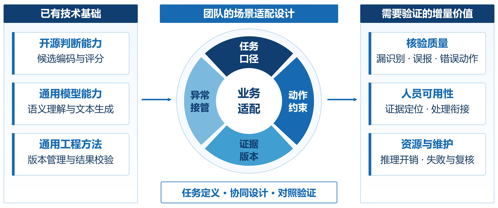

图4-3 技术继承、场景适配与创新验证

场景适配将缺件、事实冲突和复杂关系分别管理，并使原文、版本与处理依据随任务流转。同一申请中的疑点独立保留，单项处理完成后继续追踪其他未决事项。

面向工小审的拟交付成果是核验事项包，支持查看原文、纠正建议和承接未决事项。任务口径、接口和人员责任保持稳定，模型实现可按领域验证结果替换，便于在既有评审体系内逐步适配。

### （五）领域数据与验证设计

仿真材料围绕业务事实构造，标签记录答案、可比条件、原文依据和未决事项，独立复核采用仅含材料的判定表。相同事实的改写和同一申请的多项问题归入同一案例族，分组切分训练、开发与评价资料。

如图4-4所示，训练、模型选择、校准、路由条件选择与最终测试分别管理。样本有限时在训练开发范围内进行交叉验证；最终测试在方案冻结后开展。已用于错误分析的资料归入开发回归，后续效果评价采用新的独立资料。

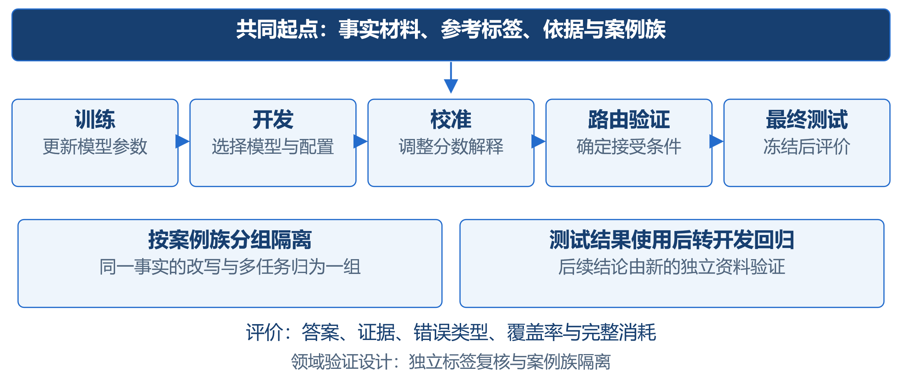

图4-4 领域适配与独立验证的目标路径

模型评价分别统计漏识别、误报、不可比识别和原文支持情况。分类器、有限候选判断与短输出生成模型采用相近的适配资源，比较核验质量和完整开销；慢分析进一步评价对快判断的纠错增量。

模型层验证有限候选判断能否在相同任务与输入条件下达到所需语义质量，并减少处理开销。优先设置同底座短输出生成或分类对照，控制模型规模、预训练与领域适配差异，评价判断方式的独立增量。

流程层固定快慢模型，比较快判断独立处理、简单分数路由和加入证据条件的路由，评价慢分析纠错、新增错误及复核工作量。在质量达标后比较完整成本，分别识别模型选择与协同流程的收益来源。

### （六）任务路由与异常接管

目标路由先确认材料和适用范围，再开展规则或语义判断。低分、缺证据和明确矛盾分别对应分析、补充与核实路径。任务接受条件通过独立验证资料选择，冻结后评价覆盖率与错误率。

路由设计将材料条件与模型不确定性分开。客观缺件先补件，不可比陈述先核对口径，明确矛盾由人员核实；仅对材料充分、关系复杂且仍有未决问题的任务评价慢分析收益。升级条件按任务在独立验证资料上选择并冻结，同时报告成功纠错、新增错误及未升级错误。当前默认采用快判断与人员复核，双系统保留为实验模式。

慢分析处理限定的未决问题，保留原快判断、返回依据与实际消耗，失败时转人员。处理顺序由材料信息依赖决定：可比材料先核验，缺失事实先取证，新材料形成后重新核验。

如图4-5所示，缺失事实、明确矛盾、复杂关系和运行异常采用不同承接方式，人员处理与模型建议分别留存。

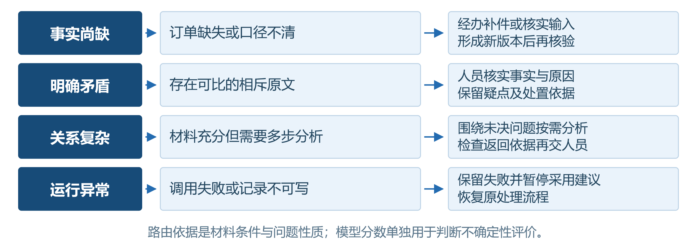

图4-5 不确定事项的原因与承接方式

### （七）系统接口与业务适配

图4-6和表4-2列出原型能力及业务适配要求。社区快判断、本地慢分析与版本化判断服务均有真实调用记录；官方Jev已完成两例仿真协议验证，并形成独立工作台入口。同任务领域对照用于确定其适用范围，工银智涌分析和工小审事项承接按银行确认的环境、接口与权限推进。

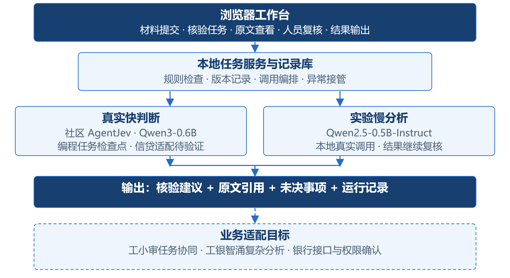

图4-6 本地原型与后续业务适配

表4-2 当前工程状态与后续验收

| 能力 | 当前实现及证据范围 | 下一阶段验收重点 |
| --- | --- | --- |
| 快判断 | 社区AgentJev／Qwen3-0.6B公开检查点；已进行本地真实推理 | 中文信贷适配、合理强对照及独立校准 |
| 慢分析 | Qwen2.5-0.5B-Instruct本地真实调用；实验替代模型 | 选取适合复杂分析的模型，验证语义质量与完整开销 |
| 路由与证据 | 输入规则、候选与引用检查、失败转人工；全部结果待复核 | 补足语义证据充分性检查，细分不确定原因 |
| 业务协同 | 本地工作台、版本记录、复核与结果输出 | 按银行确认的接口、权限及环境开展适配 |
| 官方Jev | jev-1.13.0两次仿真请求成功；独立后端与工作台入口已实现 | 同任务领域对照、候选稳定性、关键错误及完整成本 |

业务适配先明确任务入口、材料范围、结果承接方及异常恢复方式，再确认部署与接口方案。具体阶段及进入条件见第八章。

接口设计以核验事项包为交接单位，明确输入字段、输出建议、原文引用、未决事项和人员处理记录。质量验收通过后，统一核算材料处理、推理、失败重试、复核及维护开销。

## 五、实验验证与结果分析

### （一）验证范围与评价口径

本地验证分为系统功能、模型任务和业务效果三个层次。现有原型已连接材料版本、真实推理与人员处理，系统测试覆盖运行与交接行为；仿真对照评价答案与参考标签的一致情况，业务效果后续通过工时与完整成本测量评价。

表5-1列出已有实验阶段。材料均为项目自编仿真文本，参考标签待独立业务复核。六方案开发对照采用54份材料，其中47份语义任务、7份共享规则任务，按12个案例族隔离；官方Jev另完成两例协议实测，并冻结同材料、同任务的后续对照条件。[]

表5-1 已有实验阶段与证据范围

| 阶段与材料 | 实际对照配置 | 证据用途 |
| --- | --- | --- |
| 早期开发：24份6份规则／18份语义 | 输入规则；TF-IDF逻辑回归；社区AgentJev | 排查任务定义和语义错误；各方案均保留人员处理 |
| 后续挑战：28份4份规则／24份语义 | 冻结中文BERT＋分类头；社区快判断；规则＋0.5B生成；实验双系统 | 补充多方案比较与真实慢调用；结果已用于开发分析 |
| 领域开发：54份7份规则／47份语义 | 六方案同任务对照；12个案例族隔离，10个语义族训练 | 候选适配与逐例错误诊断；不作为独立银行效果评价 |
| 官方协议：2份仿真任务 | jev-1.13.0；一项用途判断、一项经营矛盾判断 | 验证官方结构化返回；领域质量另行评价 |

固定社区快判断、任务头适配、中文BERT加分类头、字符TF-IDF分类器、输入规则及Qwen2.5-0.5B JSON生成共六条路线保留逐例结果。任务头训练使用固定底座，未开展全参微调或领域概率校准；官方Jev与工银智涌不属于本轮对照对象。[]

早期规则处理6份材料，均与参考标签一致，其余18份进入语义判断。规则加TF-IDF分类器为8/24，规则加社区快判断为17/24，语义部分分别为2/18和11/18。该阶段分类器训练样本有限，结果用于排查任务定义与模型适配问题。

### （二）领域对照与结果分析

如图5-1与表5-2所示，最新54份材料中，固定社区快判断与任务头适配均为40/54，中文BERT为33/54，字符分类器为28/54，本地生成对照为25/54。语义任务分别为33/47、33/47、26/47、21/47和18/47。输入规则仅处理7份条件问题，对47份语义任务弃答转人工。

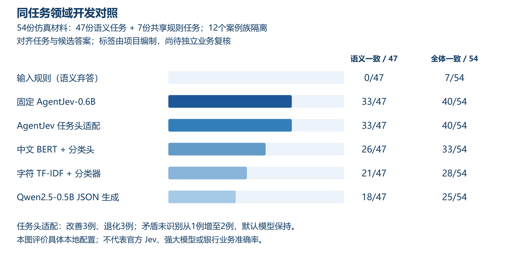

图5-1 六方案同任务领域开发对照

18份参考矛盾中，固定社区快判断未识别1份，任务头适配未识别2份；矛盾误报分别为13份和12份。分任务看，用途一致性的语义参考一致由22/25降至19/25，经营陈述矛盾由11/22增至14/22，总体仍为40/54。适配改善3例、退化3例，因此候选权重用于诊断，默认模型保持。该结果支持按任务评价适配收益，不外推为Jev范式的普遍优劣。

历史28份挑战的配对重算见图5-2：7份升级任务中，成功纠错0份、新增错误2份、正确保持4份、错误保持1份；未升级路径另保留10份错误，快判断与双系统参考一致分别为17/28和15/28。双系统请求慢模型7次，对照24次；逐例流程耗时合计为82.85秒和74.46秒，均不含此前模型加载。该次协同未形成质量或耗时增量，后续验证重点为不确定原因区分、任务升级条件及分析模型选择。

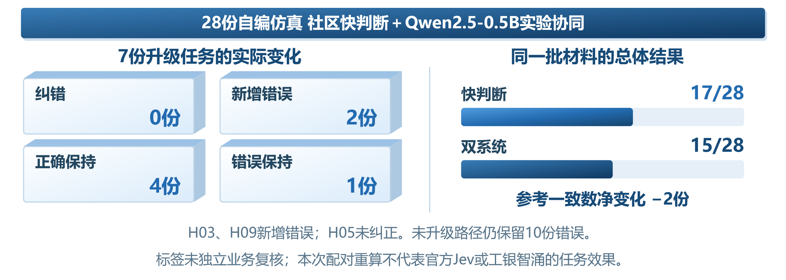

图5-2 历史双系统升级任务的配对结果

最新对照中，社区判断特征提取、BERT特征提取与生成对照的本机CPU中位耗时分别为3.42秒、0.26秒和4.21秒。前两项不含加载、训练和后续处理，生成对照含输出与引用校验，不能据此认定端到端时延优势。生成对照实际47次调用、格式检查均通过，答案一致为18/47，显示格式正确与语义正确需分别评价。[]

表5-2 同任务开发结果与关键错误

| 处理方案 | 语义一致/47 | 总体一致/54 | 矛盾未识别/18 | 矛盾误报/36 |
| --- | --- | --- | --- | --- |
| 输入规则 | 0 | 7 | 18（弃答） | 0 |
| 固定AgentJev | 33 | 40 | 1 | 13 |
| AgentJev任务头适配 | 33 | 40 | 2 | 12 |
| 中文BERT＋分类头 | 26 | 33 | 8 | 9 |
| 字符TF-IDF分类器 | 21 | 28 | 8 | 10 |
| Qwen JSON生成 | 18 | 25 | 9 | 13 |

表中一致数均按项目参考标签计算。规则的18份矛盾未识别均为语义弃答，不代表错误放行；各路线的预训练、参数规模和输出要求不同，本表评价具体处理方案。

2026年10月7日，官方Jev返回模型版本jev-1.13.0，两次请求均成功：用途一致性选择“一致”，经营陈述核验选择“发现明确矛盾”，均与对应项目参考标签一致，详见表5-3。此阶段验证限定候选判断与业务任务的连接方式；中文领域质量通过后续同任务对照和独立资料评价。

表5-3 官方Jev最小协议实测

| 仿真任务 | 官方选择 | 客户端耗时/ms | 输入Token | 输出Token |
| --- | --- | --- | --- | --- |
| 资金用途一致性 | 一致 | 1223.1 | 564 | 48 |
| 经营陈述矛盾 | 发现明确矛盾 | 1091.32 | 594 | 64 |

两例合计输入1158 Token、输出112 Token。耗时为客户端请求至完整返回，包含外部网络；输出用量为官方结构化响应Token。数据用于协议验证，不作领域准确率、服务SLA或费用节约估计。

2026年10月5日，在同一AgentJev权重上比较原任务说明与增加资金归属、经营口径约束的候选说明。全部52份均为已见开发材料，参考标签待独立复核；结果见表5-4。

表5-4 任务说明改写的配对开发结果

| 材料 | 说明版本 | 参考一致 | 漏识别 | 误报 |
| --- | --- | --- | --- | --- |
| 28份已见挑战 | 原说明 | 17/28 | 1 | 10 |
| 28份已见挑战 | 候选说明 | 16/28 | 1 | 11 |
| 24份旧开发 | 原说明 | 20/24 | 0 | 4 |
| 24份旧开发 | 候选说明 | 17/24 | 0 | 6 |

候选说明未通过预定门槛，默认配置保持原版。原正确项退化4份，关键用途冲突仍未修复，说明单独增加任务描述未改善本次领域判断。后续优化转向领域适配与合理对照。

### （三）模型质量与业务效果

模型层比较有限候选判断、领域适配的中文分类器、生成式小模型及复杂分析模型，统一材料、答案含义与证据要求。具备条件时采用同一底座及相近适配资源对比输出方式；不同底座的结果按具体配置分别报告。

流程层固定模型与材料，比较快判断独立处理、按需慢分析及带证据条件的路由，统计成功纠错、新增错误、误报和仍需人工处理的任务，评价协同是否减少疑点与复核负担。

业务层按表5-5评价完整路径。单项自动核验条件通过独立验证资料选定后冻结测试。当前全部结果经人员复核，后续受控适配阶段重点评价人员工时、接口衔接和责任承接。

表5-5 验证指标与业务采用判断

| 评价问题 | 共同报告的指标 | 采用判断 |
| --- | --- | --- |
| 核验是否可靠 | 分任务漏检、误报、不可比识别；结论的原文支持 | 满足预设关键错误要求后评价资源收益 |
| 路由是否有效 | 补件、人工与慢分析去向；升级前后的纠错和新增错误 | 升级须解决疑点；失败及未决事项有明确承接 |
| 直接处理是否可控 | 完成覆盖、完成部分错误；全部待复核任务量 | 同时评价完成覆盖与接受部分错误；零自动完成时错误率不适用 |
| 完整收益是否成立 | 实际请求、失败重试、端到端耗时；部署与复核成本 | 在同等质量下核算完整处理成本差额 |

### （四）数据管理与版本验证

迭代以明确的错误类型与修改依据为起点，对任务表达、训练材料及模型适配进行版本管理。仿真样本成对覆盖支持、矛盾、缺证据和不可比情形；同一事实的改写和同一申请的多项任务归入同组。

训练、校准、路由选择与最终评价分别管理。独立复核人员先依据材料判定，再对分歧进行裁定；模型预测与原标签不进入首次判定材料。现有28份材料的复核册及填写表已准备，独立复核尚未开展。标签更正记录依据与版本，新的效果评价采用未参与调整的资料。

数据、标签、模型、规则或路由条件更新后，先进行针对性回归，再在同一新版评价资料上重跑受影响的比较方案，历史记录留存。业务范围改变时重新定义任务与评价口径，形成独立版本结果。

如图5-3所示，领域迭代从具体错误出发，保留候选和原版，完成开发回归后以新资料评价采用效果。

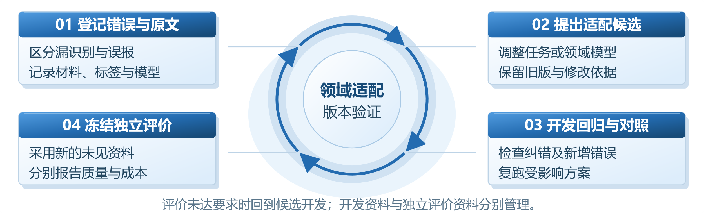

图5-3 领域迭代与版本验证闭环

### （五）模型采用与验证安排

独立评价前完成标签复核、案例族划分、候选配置、关键错误上限与测量安排，随后冻结模型及分流条件。样本规模根据错误上限和估计精度确定，报告任务、类别、案例族数量与结果不确定性，并同时评价校准效果和接受部分错误。

采用决策依据领域效果确定：快判断达标且慢分析无增益时，采用快判断与人工承接；分类器效果相当且成本更低时，替换快层模型；部分任务获得稳定收益时，限定使用范围。

本阶段已形成领域候选、六方案逐例结果、官方Jev两例协议实测和可替换判断后端。官方同任务对照已冻结54份开发材料，其中47份纳入官方语义请求范围，7份由共享规则处理；正式执行时逐例留存模型身份、判断、用量及失败记录。领域对照结果、独立标签裁定和新资料评价形成后，再评价复核工时、接口时延与完整处理成本。

如图5-4所示，核验质量、协同增量和完整收益构成逐层采用依据，各项任务按证据确定模型与使用范围。

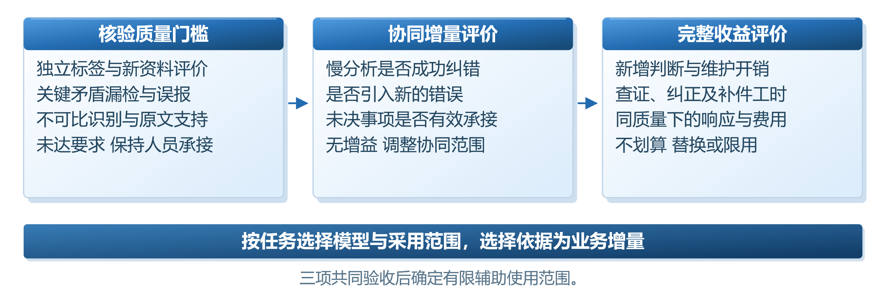

图5-4 模型采用的分层判断依据

## 六、业务价值与成本分析

### （一）业务价值与评价范围

组件按核验任务配置能力：规则检查客观缺项，快层形成有限候选建议，复杂关系按需慢分析，人员承接疑点。业务价值从材料准备、原文查证、事项交接和资源配置四方面评价。

如图6-1所示，成本评价比较“待语义判断任务全部调用同一生成模型”与“快判断前置、按需分析”两条实验路径，两者共用材料处理、规则和复核要求。

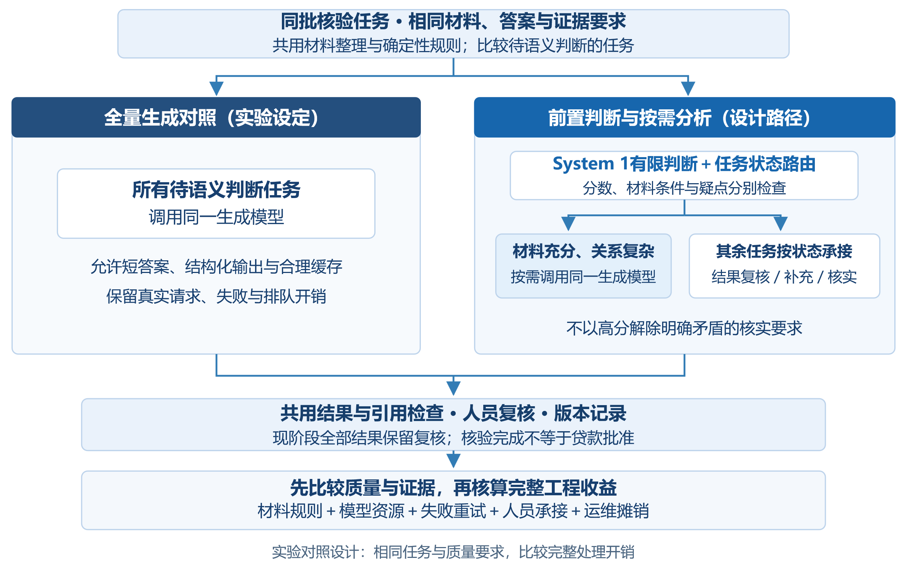

图6-1 分层分工的完整成本比较路径

### （二）核验质量与工作效率

业务评价分别记录补件往返、复核查证工时及交接遗漏，同时统计漏识别、误报和证据支持情况。核验质量达标后，比较响应、排队、推理与部署开销。

生成式对照采用与任务匹配的短答案、结构化输出、缓存和推理模式，并与分层路径保持相同工作量和证据要求。当前收益测算范围为材料核验及任务交接，贷款审批时效与自动完成比例尚无实测数据。

如图6-2所示，测量范围覆盖材料准备、模型处理、疑点处置和结果交接，人员操作工时与外部等待分别记录。

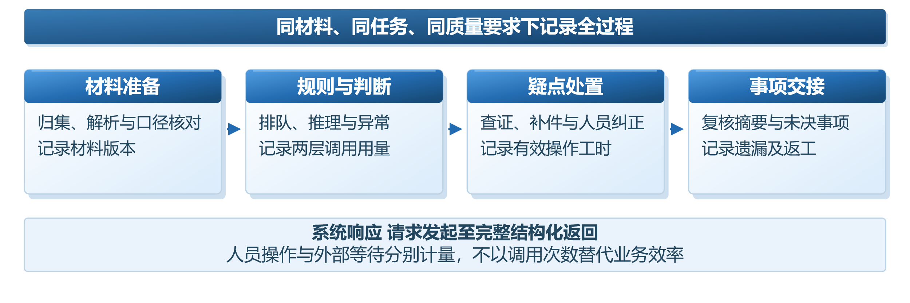

图6-2 完整核验路径的工时与时延测量

### （三）服务计费与完整成本

表6-1列示截至2026年10月2日的官方API价格，单位为每百万Token，保留原币种。公开计费作为成本测算参照，实际核算按所选模型版本、地区、档位与用量开展；社区自部署和银行内部成本分别计量。[]

表6-1 官方API计费参照与适用条件

| 服务与币种 | 输入 | 缓存命中输入 | 输出 | 本表采用的计费条件 |
| --- | --- | --- | --- | --- |
| Jev 1.13美元 | 0.042 | 未单列折扣 | 不收费 | 按输入计费；官方API价 |
| 百炼决策服务人民币 | 限时免费 | 未单列 | 无文本生成 | 预览服务；限时免费按实际计费期间核算 |
| DeepSeek Flash人民币 | 1／2 | 0.02／0.04 | 4／8 | 依次为空闲／高峰；官方直供价 |
| GLM-5.2人民币 | 8 | 2 | 28 | 中国开放平台；缓存存储暂免费 |
| 千问Plus人民币 | 0.8 | 本档未列 | 2 | 北京、实时非思考、输入≤128K |
| 豆包2.1 Lite人民币 | 0.8 | 0.16 | 2.7 | 常规在线、非音频、输入≤1024K |
| Kimi K2.6人民币 | 6.5 | 1.1 | 27 | 官方API；256K上下文 |

计价口径：DeepSeek按空闲与高峰分别计费；千问采用qwen-plus-2025-12-01的实时非思考档；豆包缓存存储另计0.017元／百万Token／小时。思考、批量、缓存及临时优惠按实际配置单独核算。

完整处理成本包括材料准备、输入编码、推理、请求失败、人员复核及部署维护。结果不收输出费的判断服务仍存在其他处理开销，生成模型的缓存复用也纳入比较。表6-2列出统一核算范围。

表6-2 完整处理成本与记录口径

| 成本组成 | 记录内容 | 核算约定 |
| --- | --- | --- |
| 材料与规则 | 解析、检索、索引、规则及工具 | 两条路径用相同材料和检查要求 |
| 模型处理 | 两层实际输入输出、排队、失败与重试 | 明确模式、服务档位、缓存及计价来源 |
| 人员承接 | 复核、纠正、补件和未决事项处理 | 实际操作与外部等待分别记录 |
| 部署与维护 | 设备、接入、监控、训练及版本维护 | 训练与建设投入按约定周期摊销 |

### （四）收益测量与采用条件

收益测量采用同一批任务、相同材料版本及质量要求，对照路径与分层路径分别记录材料处理、快慢调用、失败重试、人员查证与纠正、部署维护分摊。人员有效操作与外部等待单独计时。净节约为两条路径完整费用之差，采用条件是核验质量与人员负担满足要求，节省的复杂分析开销能够覆盖新增组件投入。风险评价首先报告核验漏识别和误报；贷款违约或损失改善需以另行跟踪资料评价。

系统时延定义为客户端发起请求至收到完整结构化结果的时间，在同一材料长度与并发配置下重复测量，分别记录首次加载、稳定运行和高负载表现。首Token时间、输出速度、人员处理及外部补件等待分别统计。

产品采用以业务增量为依据。领域质量不足时保持规则、原文定位与人员承接；分类器或短生成更适合时调整快层实现；仅在查证或交接环节获得收益时，限定为该范围的辅助审查能力。

如图6-3所示，两条路径采用相同材料和质量要求，核算模型、人员与维护的完整成本差额。

图6-3 分层处理的完整成本构成

### （五）交付内容与服务方式

面向银行交付任务规范、组件接口、原型、评测记录和版本管理方案，按确认的环境、权限及责任开展受控适配。服务与维护范围以任务种类、处理量和接口要求确定，公开API成本仅作为技术与经济性研究参照。

如图6-4所示，业务任务规范、技术组件和验证档案共同构成适配交付，由银行相应责任方确认环境与验收要求。

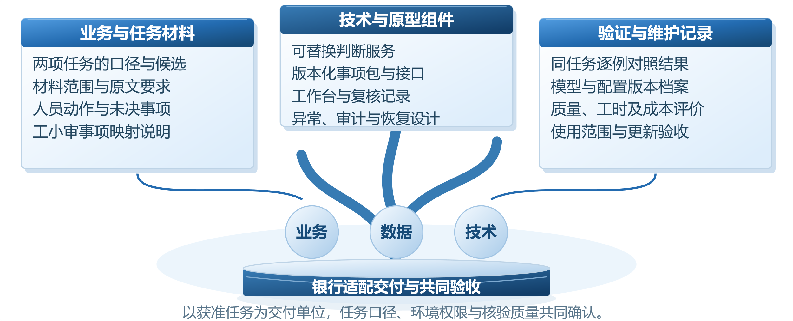

图6-4 银行适配交付内容与承接关系

2七、风险管理与数据治理

### （一）数据使用与责任分工

治理随核验任务进入流程：经办人员确认材料来源与使用范围，审查人员核对依据并处理疑点，技术人员管理版本、权限与运行异常。《银行保险机构数据安全管理办法》为数据使用和访问控制提供依据。[2]

当前演示与官方API协议实验均采用项目自编仿真文本。银行评估由业务、数据与技术责任方确认材料授权、部署位置、服务访问、留存及承接责任；客户资料仅在获准的数据与模型环境中处理。外部服务的公开性能和保留政策不替代银行对数据处理方案的审核。

如图7-1所示，材料进入、处理和交接各阶段分别确认授权、访问与责任，治理要求贯穿核验全过程。

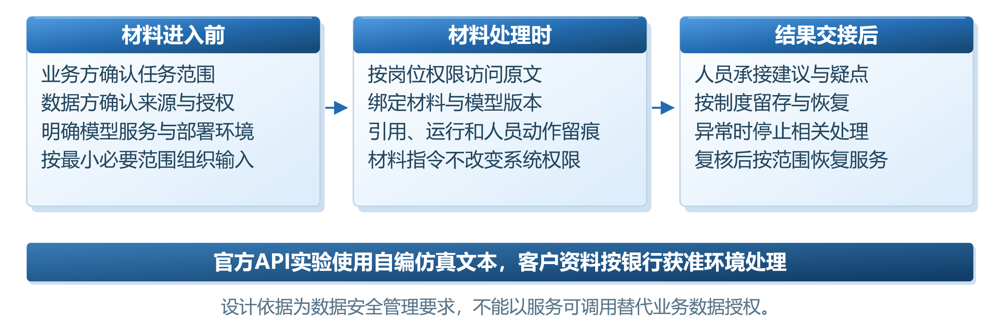

图7-1 数据处理授权与责任边界

### （二）证据管理与版本留存

每次运行绑定材料、任务和模型版本，保留原始答案、引用及人员更正。补件产生新版本并重新核验，历史记录归档为过程资料；未解决的矛盾和事项持续保留，供后续评审承接。

材料中的指令性文字属于待分析内容，不改变任务配置与允许动作。解析或检索应保留处理范围，人员同时核对引用是否存在、原文是否支持结论。图7-2以数据和模型两条线组织这些控制。

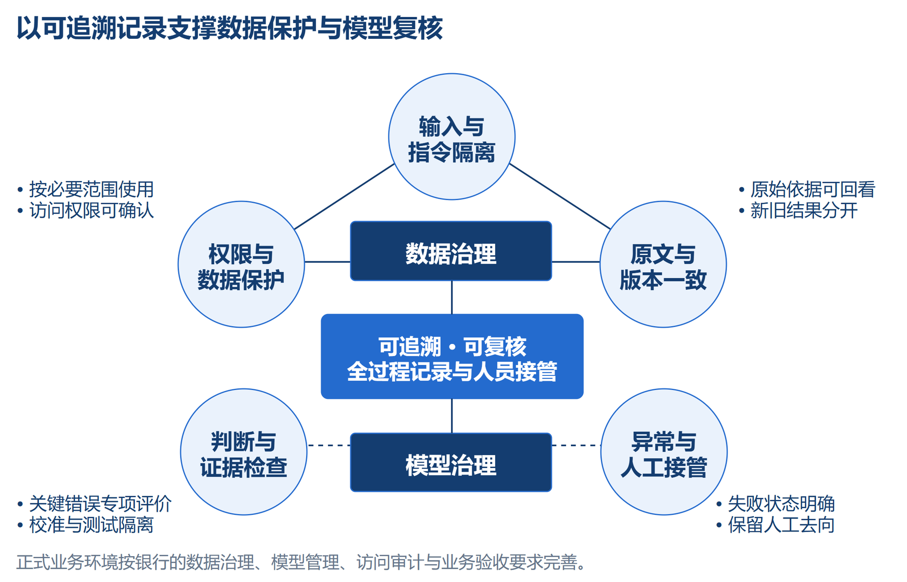

图7-2 数据与模型双层治理框架

本地记录支持流程回放。银行环境中的身份认证、授权、访问审计、留存与恢复要求，在正式适配时统一落实。

### （三）风险识别与处置机制

表7-1将核验风险对应到可观察信号、处置动作与责任人员。关键错误和证据不足进入人工核实路径，结论分数与格式检查作为辅助信息，任务质量按独立评价结果管理。

表7-1 核验风险与处置责任

| 风险信号 | 处理动作 | 承接职责与恢复依据 |
| --- | --- | --- |
| 材料来源或授权不明 | 暂停相关材料处理，核实来源与范围 | 经办与数据管理方确认后恢复 |
| 矛盾漏检、误报或证据错配 | 展示原文，记录纠正与未决事项 | 审查人员核实；技术人员回归相关错误 |
| 历史结论用于新材料 | 阻止旧结果作为当前结论，重新核验 | 经办补齐材料；复核人员确认新版本 |
| 调用失败或无法接管 | 保留失败、快判断及消耗，转原处理流程 | 技术人员定位；责任人员确认恢复条件 |
| 质量或完整成本不达要求 | 暂停扩大使用，调整任务或模型配置 | 业务与技术人员按预设要求重新评价 |

### （四）停止使用与恢复条件

出现越权处理、关键证据不可追溯、人员无法接管，或关键错误超过预设上限时，停止受影响任务并恢复原有处理方式。完成问题定位、修复回归及责任确认后恢复使用；新增任务和模型版本逐项验收。

如图7-3所示，受影响任务停止采用建议后，由原业务流程承接，完成问题修复与回归验收后按范围恢复。

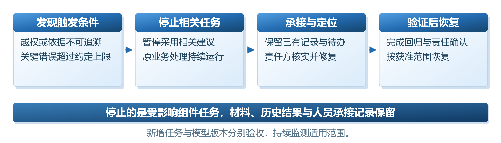

图7-3 异常停止与业务恢复闭环

## 八、实施路径与推广规划

### （一）实施阶段与验收条件

项目按本地原型、领域验证、银行离线评估、有限辅助使用和同类任务扩展五个阶段推进。本地版本化服务与六方案领域开发对照已完成，阶段建设重点转向独立标签、未见资料评价、银行任务适配与同质量收益测量。

如图8-1所示，实施计划以项目启动为M0，设置0—14个月的相对时间窗口，横向条形表示各阶段建议工期，菱形表示阶段验收节点。阶段转换以表8-1的质量、权限和人员承接条件为准，银行评估与使用范围由相应责任方确认；时间安排结合资源和验收结果细化。

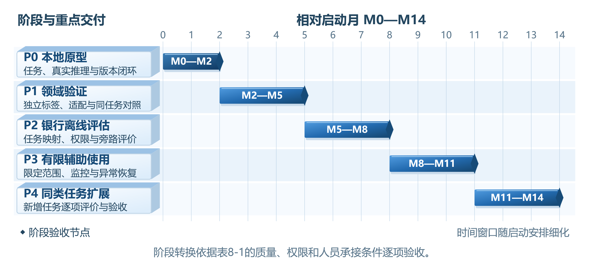

图8-1 分阶段实施标准甘特图

表8-1 分阶段交付与进入条件

| 阶段 | 主要交付 | 进入下一阶段的条件 |
| --- | --- | --- |
| P0 本地原型 | 两项任务、真实推理、版本复核与异常记录 | 链路可复现，真实调用与模拟分支明确区分 |
| P1 领域验证 | 可靠标签、领域适配、合理对照与完整成本记录 | 独立评价满足约定质量；采用范围有证据支持 |
| P2 银行离线评估 | 获准数据与环境、任务映射、责任和退出安排 | 业务与技术方确认效果、权限及人员承接 |
| P3 有限辅助使用 | 限定人员和任务范围、运行监测与回退 | 持续满足质量与运行要求，新增范围逐项评估 |
| P4 同类任务扩展 | 新任务规范、材料要求与验证记录 | 每项新增能力重新验收并确定适用条件 |

### （二）工小审任务适配

首期选择用途一致性或经营陈述矛盾中的一项任务，由银行确认现有工小审处理方式、输入材料、复核岗位及输出要求，形成同任务比较基线。组件路径保持相同材料和责任，分别记录关键错误、原文支持、查证工时、事项遗漏及完整成本；达到预登记的采用条件后确定协同范围。事项包映射任务、有效版本、原文位置和未决事项，输出用于辅助核验信息交接，授信和放款结果由原业务体系承接。

组件不可用时恢复原有处理流程，保留已产生的核验与复核记录。正式适配统一完成身份认证、权限审计、容量与恢复验证，接口操作范围限定为材料核验与结果交接。

如图8-2所示，适配围绕任务输入、核验处理和事项输出建立映射，原文位置与有效版本随结果交接。

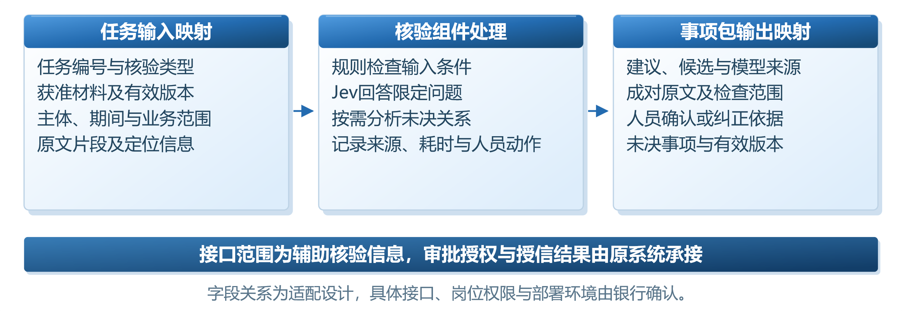

图8-2 工小审任务与核验事项包适配

### （三）银行离线评估与受控使用

如图8-3所示，银行评估先完成任务映射与独立盲评，再以旁路记录观察建议的质量、人员负担及资源开销，原业务流程持续运行。达到预先约定的质量与运行条件后，限定任务与使用人员开展辅助使用；权限、审计、恢复和责任承接共同验收。

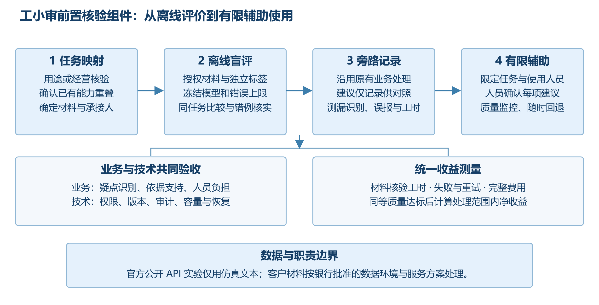

图8-3 银行离线评价与受控协同路径

### （四）阶段交付与任务扩展

阶段交付覆盖任务规范、版本化服务、原型、评测记录与离线交接包。后续按领域质量、人员工作量和完整成本确定采用范围，新增任务逐项验证后扩展。

如图8-4所示，同类任务扩展沿用稳定的版本与证据组件，新任务分别定义材料、候选和验收依据。

图8-4 同类任务扩展与交付验收

## 原稿脚注文本

[] 国务院：关于推进普惠金融高质量发展的实施意见，国发〔2023〕15号，成文2023年9月25日，发布2023年10月11日。

[] 国家金融监督管理总局：银行保险机构数据安全管理办法，金规〔2024〕24号，2024年12月27日。政府网公开文本

[] 中国工商银行股份有限公司：2025年度报告A股，2026年披露版，讨论与分析中信用风险管理数智赋能段落。

[] 中国工商银行：经营快贷官方产品说明，访问日期2026年9月27日。

[] 经济日报：我国普惠金融提质增效，2024年5月24日，上海市委金融办网站转载。

[] 金融时报：词元消耗量激增 银行需平衡算力投入与价值产出，2026年9月16日。https://www.financialnews.com.cn/2026-09/16/content_457184.html，2026年10月8日查阅。用于银行AI投入产出背景，不作为工行信贷专项成本统计。

[] daryl：《一万字Jev 工程实践长文：把 Agent 的“判断题”从大模型里拆出来》，腾讯技术工程，2026年9月29日访问。

[] 中国工商银行：中国工商银行2025年经营发展向新向优，2026年3月27日。

[] 项目系统验证记录，2026年10月7日：原型85项软件回归通过，新增官方后端覆盖规则门控、真实返回字段、用量留存、请求上限、失败接管及材料版本交接。官方最小协议工具另通过15项离线检查；同任务对照协议通过3项完整性检查。

[9] XiaokeAILabs，text_jev_train，固定提交24277dc067e2c1809013068a559c6b273b202d5d。；TypeSafe官方文档 Introduction、System One、Design、Confidence、Models（2026年10月2日查阅）：https://docs.typesafe.ai/introduction 。宋志学（Datawhale）：《一顿麦当劳早餐，人人都可训练自己的Jev决策模型！》，2026年10月2日，https://mp.weixin.qq.com/s/Hiy30Gnmk9h6kIXp_3Ucgw。

[] TypeSafe官方文档，API reference与Models，2026年10月7日查阅：https://docs.typesafe.ai/api；https://docs.typesafe.ai/models。mu架构参考：https://github.com/qybaihe/mu，固定提交47c51b0c68f622e9953b7f501d165fe474eec588；判断模块MIT许可。本项目独立实现协议适配与银行编排。

官方文档及计费页面（访问日期：2026年10月2日）：TypeSafe模型；DeepSeek模型与价格；智谱GLM-5.2；百炼决策服务；百炼决策协议；百炼模型价格；火山模型价格；Kimi K2.6。

[] 项目开发实验记录：早期24份材料、后续28份材料及52份任务说明配对；2026年10月7日54份六方案领域开发对照。冻结配置、逐例预测和版本记录归档。

[] 公开检查点aimeigaoshou/agent-jev，版本0e2593e6e6c0eade0700712ac13c4389aa7654cc。来源、权重哈希与许可记录见项目demo/models/agentjev-public及demo/vendor/agentjev。

[] 项目领域开发对照记录，2026年10月7日：54份自编仿真资料，12个案例族，10个语义族折外训练；冻结协议、47次生成对照及逐例统计留档。标签尚待独立业务复核。

[] 官方文档及计费页面（访问日期：2026年10月2日）：TypeSafe；DeepSeek；智谱；百炼价格；百炼决策服务；火山方舟；Kimi。
